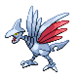
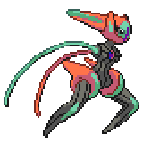

### [prev](./31_GameStateVector.md) | [next](./42_ChallengingTheBot.md)
# 4.1 The Teams
This section will provide information about the teams that are used in our training environment. Many of these teams were adapted from popular smogon teams of the Gen IV era, while some others were made by us. You might notice that the Pokemon are of varying levels. This is to balance teams with objectively stronger or weaker Pokemon.

Each Pokemon entry will include its nickname (if applicable), item, ability, EVs, nature, and moves.

## The OG
This team was made circa November 2007 by Aldaron, during the spike of stall based teams in the metagame. It utilized entry hazards and the extremely hard hitting Lucario and Life Orb Heatran to deal with Stall, and High Speed Choice Scarf Pokemon and priority to deal with offense. It is best noted for "introducing / popularizing" Swords Dance Lucario and Lead Roserade, while re-introducing Choice Scarfing high base Speed Pokemon as a viable and competitively wise strategy.

### [Roserade](https://www.serebii.net/pokedex-dp/407.shtml)  
  
Moves:

- [Grass Knot](https://www.serebii.net/attackdex-dp/grassknot.shtml)
- [Hidden Power](https://www.serebii.net/attackdex-dp/hiddenpower.shtml) Fire
- [Sleep Powder](https://www.serebii.net/attackdex-dp/sleeppowder.shtml)
- [Toxic Spikes](https://www.serebii.net/attackdex-dp/toxicspikes.shtml)  

Item: Focus Sash  
Ability: Natural Cure  
EVs: 4 Def / 252 Spe / 252 SpA  
Nature: Timid (+ Spd, - Atk)  
> I ended up sticking with Hidden Power Fire as the main move, to deter stall (Skarmory / Forretress primarily) from setting up after allowing a Pokemon to absorb sleep. I also settled on Sleep Powder + Toxic Spikes over Grass Whistle + Spikes because Sleep Powder's accuracy was much more appealing and 1 layer of Toxic Spikes is just a little worse than 1 layer of Spikes for the initial switch in.  

### [Swampert](https://www.serebii.net/pokedex-dp/260.shtml)
  
Moves:  

- [Ice Beam](https://www.serebii.net/attackdex-dp/icebeam.shtml)
- [Stealth Rock](https://www.serebii.net/attackdex-dp/stealthrock.shtml)
- [Earthquake](https://www.serebii.net/attackdex-dp/earthquake.shtml)
- [Hydro Pump](https://www.serebii.net/attackdex-dp/hydropump.shtml)  

Item: Leftovers  
Ability: Torrent  
EVs: 240 HP / 216 Def / 52 SpD  
Nature: Relaxed (+ Def, - SpD)  
> I stuck with Hydro Pump to help me deal more damage to Skarmory again (note the beat stall pattern lol). The EVs help me survive a +2 Outrage from neutral attack nature Garchomp and 2 Life Orb Shadow Balls from Gengar, even after Stealth Rock damage.  

### [Gengar](https://www.serebii.net/pokedex-dp/094.shtml)
  
Moves:  

- [Shadow Ball](https://www.serebii.net/attackdex-dp/shadowball.shtml)
- [Focus Blast](https://www.serebii.net/attackdex-dp/focusblast.shtml)
- [Thunderbolt](https://www.serebii.net/attackdex-dp/thunderbolt.shtml)
- [Hidden Power](https://www.serebii.net/attackdex-dp/hiddenpower.shtml) Ice  

Item: Choice Scarf  
Ability: Levitate  
EVs: 4 Def / 252 Spe / 252 SpA  
Nature: Timid (+ Spe, - Atk)  
> Note the Hidden Power Ice lol. Garchomp was *that* much of an issue. Also helped against Dragon Dancing Salamence, I guess, but before Platinum they weren't too much of an issue.  

### [Lucario](https://www.serebii.net/pokedex-dp/448.shtml)
  
Moves:  

- [Swords Dance](https://www.serebii.net/attackdex-dp/swordsdance.shtml)
- [Close Combat](https://www.serebii.net/attackdex-dp/closecombat.shtml)
- [Bullet Punch](https://www.serebii.net/attackdex-dp/bulletpunch.shtml)
- [Extremespeed](https://www.serebii.net/attackdex-dp/extremespeed.shtml)  

Item: Life Orb  
Ability: Inner Focus  
EVs: 4 HP / 252 Atk / 252 Spe  
Nature: Adamant (+ Atk, - SpA)  
> The main point of this team. Note that while I generally advocate Crunch as the main move for Lucario, on this team I settled on Bullet Punch to help me deal with Aerodactyl and Gengar, both of whom annoy me more than Celebi (or Cresselia / Dusknoir).  

### [Infernape](https://www.serebii.net/pokedex-dp/392.shtml)
  
Moves:  

- [Close Combat](https://www.serebii.net/attackdex-dp/closecombat.shtml)
- [Fire Blast](https://www.serebii.net/attackdex-dp/fireblast.shtml)
- [Thunder Punch](https://www.serebii.net/attackdex-dp/thunderpunch.shtml)
- [Hidden Power](https://www.serebii.net/attackdex-dp/hiddenpower.shtml) Ice  

Item: Choice Scarf  
Ability: Blaze  
EVs: 156 Atk / 232 Spe / 120 SpA  
Nature: Naive (+ Spd, - SpD)  
> Hidden Power Ice again, lol. Damn, Garchomp must have been a bitch. This reaches 341 Speed without the Scarf, to allow me to outspeed Adamant Choice Scarf Dugtrio and Dragon Dancing Salamence / Gyarados and all Choice Scarf Garchomp. The Special Attack reaches 274, or enough to one-hit KO 4 HP / 0 SpD Garchomp after SR + 1 Toxic Spike turn damage on average. The rest are put into attack so I can deal more damage with Close Combat. In Platinum, I would probably dump Thunder Punch for U-turn and Hidden Power Ice for Stone Edge (as I have for Choice Scarf Infernape on my other teams).  

### [Salamence](https://www.serebii.net/pokedex-dp/373.shtml)
  
Moves:  

- [Draco Meteor](https://www.serebii.net/attackdex-dp/dracometeor.shtml)
- [Fire Blast](https://www.serebii.net/attackdex-dp/fireblast.shtml)
- [Brick Break](https://www.serebii.net/attackdex-dp/brickbreak.shtml)
- [Roost](https://www.serebii.net/attackdex-dp/roost.shtml)  

Item: Life Orb  
Ability: Intimidate  
EVs: 76 Atk / 180 Spe / 252 SpA  
Nature: Rash (+ SpA, - SpD)  
> Classic MixMence, my second favorite Salamence set (after bulky DD roost :P). This team needs something to help deal with general stall, and there isn't much of a better Pokemon than Classic MixMence to do that. I didn't have an explanation in my word document, so my best guess regarding the EVs is that I reach 280 speed to get Heatran and Lucario, max Special Attack and dump the rest into Attack.  

## Stall Team
Obi's stall team is perhaps the most celebrated of all teams in the DPP generation. It is often said that, pre-Platinum, it was hard to make a successful stall team without reducing it to Obistall. The team was especially responsible for Tentacruel's rise from the UU Tier to the OU Tier, as people discovered its niche in the metagame. The huge amount of thought and effort put into the team is apparent in the presentation of the team-building process and the in-depth description of every choice made. This team combines all of the elements needed to create a "full" Stall team, and acts as an excellent example to anyone looking to play the slower game.

### [Hippowdon](https://www.serebii.net/pokedex-dp/450.shtml) - "Daedalus"
  
Moves:  

- [Stealth Rock](https://www.serebii.net/attackdex-dp/stealthrock.shtml)
- [Slack Off](https://www.serebii.net/attackdex-dp/slackoff.shtml)
- [Earthquake](https://www.serebii.net/attackdex-dp/earthquake.shtml)
- [Ice Fang](https://www.serebii.net/attackdex-dp/icefang.shtml)  

Item: Leftovers  
Ability: Sand Stream  
EVs: 252 HP / 24 Atk / 192 Def / 40 SpD  
Nature: Impish (+ Def, - SpA)  
> Putting down Stealth Rock ASAP negates Focus Sash (as does Sand Stream, but some Pokemon are immune to that). Stealth Rock removes the possibility of a Bellyzard sweep with Sand Stream support. The first two parts of my "secondary" damage.  
> To explain the EVs, max HP maximized overall defenses. 192 Def with an Impish nature gives 2 more points than 188, which helps maximize overall physical defensiveness. The 24 Attack guaranteed a certain amount of damage on a Pokemon that I have since forgotten, and the rest went into Special Defense to take stuff like Hidden Power from Electrics.  

### [Skarmory](https://www.serebii.net/pokedex-dp/227.shtml) - "Icarus"
  
Moves:  

- [Whirlwind](https://www.serebii.net/attackdex-dp/whirlwind.shtml)
- [Spikes](https://www.serebii.net/attackdex-dp/spikes.shtml)
- [Roost](https://www.serebii.net/attackdex-dp/roost.shtml)
- [Brave Bird](https://www.serebii.net/attackdex-dp/bravebird.shtml)  

Item: Shed Shell  
Ability: Keen Eye  
EVs: 252 HP / 200 Def / 40 SpD / 16 Spe  
Nature: Impish (+ Def, - SpA)  
> The next part of my "secondary" damage, Spikes. Skarmory has some great resistances to abuse here. It helps Whirlwind out stat-uppers like Curse Miltank and Snorlax, as well as just phazing stuff to rack up Spikes damage. I use Shed Shell because Magnezone is a punk. Brave Bird is needed to do something useful to Starmie, Tentacruel, and Gyarados, 3 big opponents to stall teams who think they can take on Skarmory.  
> I moved those 16 EVs from Attack to Speed on this posting, because that's where they were supposed to be. It's primarily to beat other Skarmory to the WW.  

### [Tentacruel](https://www.serebii.net/pokedex-dp/073.shtml) - "Morpheus"
  
Moves:  

- [Toxic Spikes](https://www.serebii.net/attackdex-dp/toxicspikes.shtml)
- [Rapid Spin](https://www.serebii.net/attackdex-dp/rapidspin.shtml)
- [Surf](https://www.serebii.net/attackdex-dp/surf.shtml)
- [Hidden Power](https://www.serebii.net/attackdex-dp/hiddenpower.shtml) Electric  

Item: Leftovers  
Ability: Liquid Ooze  
EVs: 252 HP / 120 Def / 136 SpD  
Nature: Calm (+ SpD, - Atk)  
> The last part of my "secondary" damage, Toxic Spikes. ~~Rapid Spin + Knock Off is illegal, so I decided on Rapid Spin here.~~ Toxic Spikes means Restless Dusknoir and Spiritomb can't stop me, and Gengar is too frail to keep coming in (and can't OHKO Tentacruel, anyway). Hidden Power Electric helps vs. Empoleon, Starmie, enemy Tentacrual, and Gyarados, mostly, all of shich are more common foes for Tentacrual than Garchomp, Dragonite, Celebi, or Salamence.  

### [Blissey](https://www.serebii.net/pokedex-dp/242.shtml) - "Helios"
  
Moves:  

- [Wish](https://www.serebii.net/attackdex-dp/wish.shtml)
- [Protect](https://www.serebii.net/attackdex-dp/protect.shtml)
- [Flamethrower](https://www.serebii.net/attackdex-dp/flamethrower.shtml)
- [Toxic](https://www.serebii.net/attackdex-dp/toxic.shtml)  

Item: Leftovers  
Ability: Natural Cure  
EVs: 252 Def / 40 SpA / 216 SpD  
Nature: Calm (+ SpD, - Atk)  
> Yes, I know what you're thinking, "Calm Blissey with tons of Special Defense EVs!? Are you crazy? Toxic on a team with Toxic Spikes? Are you insane?" Well, yes, I am, but that's irrelevant to this.  
> First, Toxic. 3 of the biggest special attacking threats, Azelf, Togekiss, and Zapdos, are completely immune to Toxic Spikes, and two of those have Roost and/or Wish to heal themselves, meaning Blissey normally can't KO them. With Toxic, Blissey can just hit them with that and start stalling. Wish + Protect helps further with this, so that Blissey can take on that Nasty Plot Aura Sphere Togekiss that thinks it is a Blissey counter because it has Roost.  
> Blissey has all that Special Defense because it needs it. This isn't ADV, people. The level of special attacking power available this generation easily exceeds ADV ubers, and nobody questioned using Special Defense EVs and Calm there (at least not at the end when people realized it isn't OU). Blissey needs Special Defense EVs if it plans to stand up to the likes of Nasty Plot Aura Sphere Togekiss, Focus Blast Gengar, and yes, with this spread, Blissey even has a shot at surviving the much acclaimed Modest Life Orb Nasty Plot Adaptability Hyper Beam PorygonZ (although Blissey isn't usually my first switch into that). It will always survive the same from +SpA Download PorygonZ (although it will sometimes fall to Sandstorm afterward). Blissey needs it to survive Choice Specs Flash Fire Fire Blasts from Heatran.  
> My next big issue here was what form of healing to use on Blissey. In the end, I decided that Tentacruel lacks its own way to heal, so Wish would be useful there. Wish also tends to be passed to the only other member of the team without reliable healing, Spiritomb. If you'll notice, both Tentacruel and Spiritomb resist or are immune to Blissey's weakness, Fighting. So I had to choose between Wish and Softboiled or Wish and Protect. I eschewed Softboiled in favor of Protect for a few reasons. First, Choice Banders love to switch into Blissey when they realize I don't have Thunder Wave, especially Heracross. Protect first, and suddenly they aren't so threatening. Blissey can easily stall that Choice Band Heracross that tries to use Pursuit. Meanwhile, Sandstorm is wearing them down. Protect has also caught so many Gengar, Azelf, Heatran, and Bronzong Explosions for me. Finally, Wish + Protect leaves me vulnerable to a critical hit from something like Aura Sphere Togekiss half as often as Softboiled spamming would for the same amount of Toxistalling.  
> So the only thing left unexplained is my final move, Flamethrower. My options, really, were Seismic Toss, Thunderbolt, Ice Beam, Flamethrower, Grass Knot, Psychic (lol). One requirement was that Blissey had to be able to hit Gengar, or else I'd be weak to a Life Orb Gengar with Focus Punch or Focus Blast, so Seismic Toss and Grass Knot were instantly thrown out. After that, it was just "What kind of stuff likes to switch into Blissey, and what can't Blissey reliably take on with Toxic that it could beat with another move?"  
> If I can't break Abomasnow's Substitutes, I'd have to use Sludge Bomb on Tentacruel, or I'd lose to that. Substitute Raikou could at least be forced out thanks to Celebi, and it would slowly be worn down by Sandstorm and its own Substitutes, if nothing else, so it wasn't as critical as Abomasnow. Blissey is supposed to wall SpecsMence, but it's not going to get through Blissey ever unless it gets 2 CHes or a CH and tons of spike clones are down, and in neither of those cases do I even get a chance to attack, anyway, so as long as I can do something to it, I'll win out in the end. If need be, it can be hit with Toxic, Sandstorm stalled with Protect and Wish, and just generally worn down thanks to Stealth Rock. Physical versions are just going to OHKO Blissey after a set-up or 2HKO with Choice Band Dragon Claw or whatever, so once again, Blissey can't hit it.  
> Heracross, Weavile, Tyranitar, and Lucario like to switch into Blissey. Flamethrower hits 3 of those SE, and barely dents Tyranitar. Thunderbolt is neutral on all (and neutral may as well be NVE for all it does to most of these guys). Ice Beam is resisted by 2 and neutral on the others (ah, that's even worse!). Psychic is SE on Heracross, neutral on Lucario, and doesn't touch Weavile or Tyranitar. Flamethrower obviously has the best coverage for stuff that generally switches into Blissey.  
> Flamethrower has also netted me several Forretress kills and a few Scizor kills. It lets Blissey beat those annoying Skarmory, because it's still SE, even if they Roost.  
> If you'll notice, I cannot touch Heatran at all. However, Heatran is almost always Scarfed or Specsed. This means it's easily PP stalled out of its Fire move (Overheat and Fire Blast have 8 PP). However, I'll still have to kill it eventually. Fortunately, Tentacruel is a Special Defensive beast. The only way Heatran is even considering touching it is with Earth Power, which does pittance to Celebi and less to Skarmory. Without Choice Specs, it won't do enough to Tentacruel in case someone suggests a non-Choice item Heatran as a way to beat my team. I guess I do have a Substitute, Flamethrower, Nasty Plot, HP Electric / HP Ground Houndoom weakness, but whatever.  
> With the rise of Heatran in Platinum (and the fall of guys like Weavile), I would very well consider something like Thunderbolt so I can at least touch Heatran (and thus not instantly lose to Taunt Heatran), because I don't like to overload Tentacruel.  

### [Celebi](https://www.serebii.net/pokedex-dp/251.shtml) - "Celobi"
  
Moves:  

- [Recover](https://www.serebii.net/attackdex-dp/recover.shtml)
- [Perish Song](https://www.serebii.net/attackdex-dp/perishsong.shtml)
- [Grass Knot](https://www.serebii.net/attackdex-dp/grassknot.shtml)
- [U-turn](https://www.serebii.net/attackdex-dp/u-turn.shtml)  

Item: Leftovers  
Ability: Natural Cure  
EVs: 252 HP / 216 Def / 8 SpD / 32 Spe  
Nature: Bold (+ Def, - Atk)  
> Ah, my main Gyarados counter, and the reason I don't lose to last Pokemon <stat-upper that can block toxic in some way>. Also the best answer to Baton Pass chains.  
> Grass Knot obviously works to stop Gyarados(it does about 40% to it, so a 2HKO if it's hit by Stealth Rock, 3HKO otherwise). Meanwhile, the only way Gyarados is hurting Celebi at all is with Ice Fang. If it has DD and Ice Fang, then it lacks EQ, meaning Tentacruel can come in and use Hidden Power Electric for ~50% damage, or it lacks Waterfall, meaning Skarmory has some fun with Brave Bird, or maybe it lacks Taunt, meaning Skarmory can still Roost and Whirlwind, or, as an absolute last resort, Blissey can Toxic. Grass Knot also covers Tyranitar somewhat, and does a surprising amount of damage to Spiritomb (I don't know about Dusknoir because it's not as common). Celebi with Grass Knot laughs in the face of Hippowdon and Swampert, too.  
> Perish Song works as pseudo-phazing, stops BP chains (unless they catch on and Baton Pass Ingrain to Mr. Mime, I guess, but if you got Toxic Spikes down, even that won't fly), and infuriates anything Umbreon tries to pull off. U-turn lets you switch out and see who they are replacing when they're leaving for fear of Perish Song, and keeps the aforementioned Umbreon from trapping you. I'm still waiting for the day I use U-turn on the final turn of Perish Song, but they switch to Garchomp, and Sand Veil causes U-turn to miss, so I end up dying to my own trap.  
> The purpose of the EVs is as follows: maximize HP to maximize overall defenses. 32 Speed beats even Jolly Tyranitar, 216 Def with Bold gives me the extra point, and then I put the rest in Special Defense to take Ice Beams slightly better.  
> This dude, like the rest of my team members, has an awesome nickname, as well.  

### [Spiritomb](https://www.serebii.net/pokedex-dp/442.shtml) - "The Man Who Was Thursday"
  
Moves:  

- [Shadow Ball](https://www.serebii.net/attackdex-dp/shadowball.shtml)
- [Rest](https://www.serebii.net/attackdex-dp/rest.shtml)
- [Sleep Talk](https://www.serebii.net/attackdex-dp/sleeptalk.shtml)
- [Hidden Power](https://www.serebii.net/attackdex-dp/hiddenpower.shtml) Fighting  

Item: Leftovers  
Ability: Pressure  
EVs: 252 HP / 100 Def / 156 SpD  
Nature: Calm (+ SpD, - Atk)  
> Blocks Rapid Spin, counters Lucario and other fighters. Absorbs Sleep, too. Spiritomb can just wall most stall teams that I've faced.  

## Teacher's Out
This team revolves around using the move Substitute, which creates a proxy Pokemon that blocks for the user at the cost of 25% of its HP.  

### [Garchomp](https://www.serebii.net/pokedex-dp/445.shtml)
  
Moves:  

- [Substitute](https://www.serebii.net/attackdex-dp/substitute.shtml)
- [Swords Dance](https://www.serebii.net/attackdex-dp/swordsdance.shtml)
- [Dragon Claw](https://www.serebii.net/attackdex-dp/dragonclaw.shtml)
- [Earthquake](https://www.serebii.net/attackdex-dp/earthquake.shtml)  

Item: Salac Berry  
Ability: Sand Veil  
EVs: 252 Atk / 4 SpD / 252 Spe  
Nature: Jolly  

### [Gengar](https://www.serebii.net/pokedex-dp/094.shtml)
  
Moves:  

- [Substitute](https://www.serebii.net/attackdex-dp/substitute.shtml)
- [Pain Split](https://www.serebii.net/attackdex-dp/painsplit.shtml)
- [Shadow Ball](https://www.serebii.net/attackdex-dp/shadowball.shtml)
- [Focus Blast](https://www.serebii.net/attackdex-dp/focusblast.shtml)  

Item: Black Sludge  
Ability: Levitate  
EVs: 4 Def / 252 SpA / 252 Spe  
Nature: Timid  

### [Togekiss](https://www.serebii.net/pokedex-dp/468.shtml)
  
Moves:  

- [Substitute](https://www.serebii.net/attackdex-dp/substitute.shtml)
- [Defog](https://www.serebii.net/attackdex-dp/defog.shtml)
- [Body Slam](https://www.serebii.net/attackdex-dp/bodyslam.shtml)
- [Air Slash](https://www.serebii.net/attackdex-dp/airslash.shtml)  

Item: Leftovers  
Ability: Serene Grace  
EVs: 252 HP / 188 Def / 68 SpD  
Nature: Bold  

### [Breloom](https://www.serebii.net/pokedex-dp/286.shtml)
  
Moves:  

- [Substitute](https://www.serebii.net/attackdex-dp/substitute.shtml)
- [Spore](https://www.serebii.net/attackdex-dp/spore.shtml)
- [Leech Seed](https://www.serebii.net/attackdex-dp/leechseed.shtml)
- [Focus Punch](https://www.serebii.net/attackdex-dp/focuspunch.shtml)  

Item: Toxic Orb  
Ability: Poison Heal  
EVs: 252 HP / 48 Atk / 208 Def  
Nature: Adamant  

### [Machamp](https://www.serebii.net/pokedex-dp/068.shtml)
  
Moves:  

- [Substitute](https://www.serebii.net/attackdex-dp/substitute.shtml)
- [Dynamic Punch](https://www.serebii.net/attackdex-dp/dynamicpunch.shtml)
- [Payback](https://www.serebii.net/attackdex-dp/payback.shtml)
- [Stone Edge](https://www.serebii.net/attackdex-dp/stoneedge.shtml)  

Item: Leftovers  
Ability: No Guard  
EVs: 128 HP / 252 Atk / 128 Spe  
Nature: Adamant  

### [Jirachi](https://www.serebii.net/pokedex-dp/385.shtml)
  
Moves:  

- [Substitute](https://www.serebii.net/attackdex-dp/substitute.shtml)
- [Calm Mind](https://www.serebii.net/attackdex-dp/calmmind.shtml)
- [Thunderbolt](https://www.serebii.net/attackdex-dp/thunderbolt.shtml)
- [Psychic](https://www.serebii.net/attackdex-dp/psychic.shtml)  

Item: Leftovers  
Ability: Serene Grace  
EVs: 252 HP / 80 SpA / 176 Spe  
Nature: Timid  

## We Are The Machampions!
This team is designed to abuse paralysis and what is popularly termed as "hax" by working off paralysis support with confusion-inducing and flinching moves. The team is very balanced, with defensive Pokemon such as Jirachi and Blissey coupled with heavy offense in Dragon Dance Gyarados and Choice Band Tyranitar, and when these elements are combined with paralysis support, a powerful core is formed. This team is the epitome of strategy-based teams; rather than solely worrying about countering and checking the top threats of the metagame, Obi forms a core strategy and attempts to execute it regardless of the opponent's one.

### [Jirachi](https://www.serebii.net/pokedex-dp/385.shtml) - "Homeland Security"
  
Moves:  

- [Stealth Rock](https://www.serebii.net/attackdex-dp/stealthrock.shtml)
- [Wish](https://www.serebii.net/attackdex-dp/wish.shtml)
- [Zen Headbutt](https://www.serebii.net/attackdex-dp/zenheadbutt.shtml)
- [Body Slam](https://www.serebii.net/attackdex-dp/bodyslam.shtml)  

Item: Leftovers  
Ability: Serene Grace  
EVs: 252 HP / 8 Atk / 216 Def / 32 Spe  
Nature: Impish (+ Def, - SpA)  
> Jirachi is pretty cool. I like Stealth Rock because it's awesome and helps vs. enemy trainers trying to just switch around a lot. Body Slam has 60% chance to Paralyze, which royally screws over BPers. I love it when Garchomp comes in, thinking it has a safe switch, only to be nailed by a paralysis, which really puts a damper on its ability to sweep. Jirachi takes Dragon moves, mostly. Body Slam + Zen Headbutt + Serene Grace = they aren't moving very much.  

### [Machamp](https://www.serebii.net/pokedex-dp/068.shtml) - "Big Brother"
  
Moves:  

- [Dynamic Punch](https://www.serebii.net/attackdex-dp/dynamicpunch.shtml)
- [Rest](https://www.serebii.net/attackdex-dp/rest.shtml)
- [Sleep Talk](https://www.serebii.net/attackdex-dp/sleeptalk.shtml)
- [Ice Punch](https://www.serebii.net/attackdex-dp/icepunch.shtml)  

Item: Leftovers  
Ability: No Guard  
EVs: 252 HP / 220 Atk / 36 Def  
Nature: Adamant (+ Atk, - SpA)  
> When everyone is paralyzed, Machamp is probably moving first. Dynamic Punch gives guaranteed confusion, which is 50% shot to hit yourself in your confusion. Add in Paralysis and you have one mean fighter. I used to use Rock Slide in the last slot becuase I liked the flich thing and it has more PP than Stone Edge, but in the end Gliscor proved to be too annoying. It's easier to take down Gyarados and the like, because they are less likely to have Rest vs. Gliscor almost always having Roost.  

### [Tyranitar](https://www.serebii.net/pokedex-dp/248.shtml) - "FBI"
  
Moves:  

- Pursuit
- [Earthquake](https://www.serebii.net/attackdex-dp/earthquake.shtml)
- [Stone Edge](https://www.serebii.net/attackdex-dp/stoneedge.shtml)
- Crunch  

Item: Choice Band  
Ability: Sand Stream  
EVs: 252 HP / 252 Atk / 4 SpD  
Nature: Adamant  
> I Pursuit those annoying Ghosts, Cresselia, and Aromatherapy Blissey with this guy. I never use Stone Edge unless I need it for a OHKO, because I hate missing. I'm considering Rock Slide, but then it's weaker than Crunch, and sometimes you need that extra kick.  

### [Blissey](https://www.serebii.net/pokedex-dp/242.shtml) - "NSA"
  
Moves:  

- Thunder Wave
- Softboiled
- [Flamethrower](https://www.serebii.net/attackdex-dp/flamethrower.shtml)
- [Hidden Power](https://www.serebii.net/attackdex-dp/hiddenpower.shtml) Ground  

Item: Leftovers  
Ability: Natural Cure  
EVs: 252 Def / 80 SpA / 176 SpD  
Nature: Calm (+ SpD, - Atk)  
> I've been using Grass Knot, but I find that I usually want Hidden Power Ground. My three main hang-ups with that are Tyranitar (not hit as hard by Hidden Power Ground compared to Grass Knot), Starmie (if it has Surf, Thunderbolt, Ice Beam, Recover, it can be annoying, otherwise Celebi, Tyranitar, or Gyarados beat it handily, depending on what attack it drops for Rapid Spin), and Roaring Blizzard Walrein (without Roar, Gyarados sets up, and without Blizzard, Celebi takes it down), although Jirachi can take on Walrein easy, it can get worn down with Spikes on my side. Roar Swampert can also be a pest. Hidden Power Ground would let me do something to Infernape once I get it paralyzed, decimates Heatran, does something to Tentacruel, and has a lot of other cool uses. I find myself in need of HP Ground more than I use Grass Knot, but some of the Grass Knot foes are big trouble if I can't stop them.  

### [Celebi](https://www.serebii.net/pokedex-dp/251.shtml) - "Secret Service"
  
Moves:  

- [Grass Knot](https://www.serebii.net/attackdex-dp/grassknot.shtml)
- [Hidden Power](https://www.serebii.net/attackdex-dp/hiddenpower.shtml) Ice
- [Recover](https://www.serebii.net/attackdex-dp/recover.shtml)
- Thunder Wave  

Item: Leftovers  
Ability: Natural Cure  
EVs: 252 HP / 220 Def / 4 SpD / 32 Spe  
Nature: Bold (+Def, -Atk)  
> Grass Knot and Hidden Power Ice hit just about everything immune to Thunder Wave for SE damage. The only exceptions I can think of are Limber Pokemon (who are mostly Fighters, who pretty much lose to Celebi regardless), Steelix, and Camerupt. The only reason I have HP Ice over Psychic is because of Garchomp, who Celebi takes on surprisingly well.  

### [Gyarados](https://www.serebii.net/pokedex-dp/130.shtml) - "CIA"
  
Moves:  

- [Rest](https://www.serebii.net/attackdex-dp/rest.shtml)
- [Sleep Talk](https://www.serebii.net/attackdex-dp/sleeptalk.shtml)
- Waterfall
- Dragon Dance  

Item: Leftovers  
Ability: Intimidate  
EVs: 252 HP / 176 Atk / 60 Def / 20 Spe  
Nature: Adamant  
> This guy is pretty cool. Late game, I consider what kind of team they have. If I'm having trouble breaking their stall, for instance, I'll kill off every other member of my team to kill their Celebi, Charge Beam Cresselia, and Thunderbolt Starmie, and then just DD up for free with Gyarados as they are now unable to phaze me. I need Gyarados to take on Fighters and such, especially Infernape. I'm considering Moltres with a set like Flamethrower, HP Ice, Substitute, Roost in this slot. I used to have Ice Fang over Dragon Dance for Garchomp, but I decided DD is actually lot better to take on non-SD Chomp. I'm thinking of lowering its Attack to make it bulkier. The main reason I am using Gyarados over Moltres is Intimidate, really, and the 2x Rock weakness instead of 4x.  

## Team Astral Projection
A pre-Platinum offense team that featured both Garchomp and Deoxys-S. At the time, the Wobbuffet test was also being conducted. The team itself was posted almost to prove the point that pure offense teams could still dominate, despite the Speed and type coverage that the newly OU Deoxys-S could use to threaten such teams. This team provided pressure from the get go, with well placed resistances being used to repeatedly get in an advantageous position against the opponent. The team worked mainly around intelligent prediction, and husk was sure to point this out in the "Team Work" sections of his write up. This way, he was able to show those who rated the team exactly how he used combinations of the Pokemon in his team to beat certain problematic threats.  

### [Aerodactyl](https://www.serebii.net/pokedex-dp/142.shtml)
  
Moves:  

- [Stealth Rock](https://www.serebii.net/attackdex-dp/stealthrock.shtml)
- Taunt
- Rock Slide
- [Earthquake](https://www.serebii.net/attackdex-dp/earthquake.shtml)  

Item: Focus Sash  
Ability: Pressure  
EVs: 4 HP / 252 Atk / 252 Spe  
Nature: Jolly (+Spe, -SpA)  
> Aerodactyl is a great lead. He usually gets off a quick SR and can often cripple leading pokes such as Salamence/Gyarados/Garchomp/Azelf. Slower leads are generally there to SR so he'll taunt them to keep the rocks off. I had Stone Edge over Rock Slide and Ice Fang over Earthquake but I found that I missed far too often with both for them to be useful. I also realized I had a Metagross problem so the more ground attacks, the better.  

### [Gyarados](https://www.serebii.net/pokedex-dp/130.shtml)
  
Moves:  

- Dragon Dance
- [Earthquake](https://www.serebii.net/attackdex-dp/earthquake.shtml)
- [Ice Fang](https://www.serebii.net/attackdex-dp/icefang.shtml)
- Waterfall  

Item: Life Orb  
Ability: Intimidate  
EVs: 80 HP / 252 Atk / 176 Spe  
Nature: Adamant (+Atk, -SpA)  
> This set is fairly self-explanitory. After a Dragon Dance, few things can stand up to this. This 2HKOs Celebi and with Stealth Rock down often OHKOs Starmie. Cresselia is 2 or 3HKO'd and so is Skarmory. If this gets a Dragon Dance in, my opponenet generally loses at least one very valuable member of their defensive core which is very important as most of those Pokemon are used to counter multiple threats.  

### [Gengar](https://www.serebii.net/pokedex-dp/094.shtml)
  
Moves:  

- [Shadow Ball](https://www.serebii.net/attackdex-dp/shadowball.shtml)
- Explosion
- [Focus Blast](https://www.serebii.net/attackdex-dp/focusblast.shtml)
- Hypnosis  

Item: Life Orb  
Ability: Levitate  
EVs: 40 Atk / 252 Spe / 216 SpA  
Nature: Timid  
> Shadow Ball/Focus Blast hit everything neutrally and Hypnosis + Explosion basically guarantees that Gengar will take two Pokemon out of the match. Life Orb moves a lot of 3HKOs to 2HKOs which is extremely important for Gengar as with a little prediction you may manage to die from 10 turns of Life Orb recoil rather than your opponent's attacks.  

### [Garchomp](https://www.serebii.net/pokedex-dp/445.shtml)
  
Moves:  

- [Earthquake](https://www.serebii.net/attackdex-dp/earthquake.shtml)
- [Dragon Claw](https://www.serebii.net/attackdex-dp/dragonclaw.shtml)
- Fire Fang
- Outrage  

Item: Choice Band  
Ability: Sand Veil  
EVs: 4 HP / 252 Atk / 252 Spe  
Nature: Adamant (+Atk, -SpA)  
> This thing is absolutely amazing. There really isn't much this doesn't straight up 2HKO with Stealth Rock down so if my opponent switches, I should net a KO unless I predict incorrectly.  

### [Lucario](https://www.serebii.net/pokedex-dp/448.shtml)
  
Moves:  

- [Close Combat](https://www.serebii.net/attackdex-dp/closecombat.shtml)
- [Swords Dance](https://www.serebii.net/attackdex-dp/swordsdance.shtml)
- [Bullet Punch](https://www.serebii.net/attackdex-dp/bulletpunch.shtml)
- [Extremespeed](https://www.serebii.net/attackdex-dp/extremespeed.shtml)  

Item: Life Orb  
Ability: Inner Focus  
EVs: 4 HP / 252 Atk / 252 Spe  
Nature: Adamant (+Atk, -SpA)  
> Lucario tears stuff up with or without using Swords Dance. Bullet Punch is used instead of Crunch as Dusknoir, Celebi, and Cresselia are usually overwhelmed by the offense on this team while opposing Gengars and Mismagius' are a very serious threat. Life Orb is required as a Swords Danced Bullet Punch doesn't OHKO Gengar otherwise.  

### [Deoxys-S](https://www.serebii.net/pokedex-dp/386.shtml)
  
Moves:  

- [Ice Beam](https://www.serebii.net/attackdex-dp/icebeam.shtml)
- [Thunderbolt](https://www.serebii.net/attackdex-dp/thunderbolt.shtml)
- Superpower
- [Shadow Ball](https://www.serebii.net/attackdex-dp/shadowball.shtml)  

Item: Life Orb  
Ability: Pressure  
EVs: 4 Atk / 252 Spe / 252 SpA  
Nature: Naive (+Spe, -SpD)  
> Shadow Ball is placed over Psychic and Recover as I have trouble with Psychic types. Shadow Ball also helps me revenge kill nonscarfed Garchomp.  

## Team Antimatter
This team was built early on in the Platinum release. It ultimately demonstrated how powerful Scarf Skymin (Shaymin-Sky) could be, both as a lead and as a late-game sweeper. Kevin Garrett and Limitless picked every Pokemon for a certain reason, to counter or check opposing offensive teams. They did this in a style not too many teams had used at this point, but is now abundantly seen. Using fast, bulky Pokemon to gain the upper hand swiftly, it allowed them to maintain this advantage for the rest of the game. This team also helped display the power of Dragon Dance Kingdra as its sweep was the final objective of the team.  

### [Shaymin-S](https://www.serebii.net/pokedex-dp/492.shtml)
  
Moves:  

- Seed Flare
- [Air Slash](https://www.serebii.net/attackdex-dp/airslash.shtml)
- Earth Power
- [Hidden Power](https://www.serebii.net/attackdex-dp/hiddenpower.shtml) Fire  

Item: Choice Scarf  
Ability: Serene Grace  
EVs: 4 HP / 252 Spe / 252 SpA  
Nature: Modest (+SpA, -Atk)  
> Scarf Shaymin has unparalleled speed. Since this variation can't overwhelm its counters, it is used as an anti-lead and late-game sweeper. Aside from Air Slash, which can occasionally chain flinches, it isn't meant to be a staying power (more like a trump card). Seed Flare 2HKOs Zapdos with Stealth Rock in play, providing a special defense drop is applied. Earth Power is mainly for fooling Heatran and Hidden Power Fire takes care of Scizor, Skarmory, etc.  

### [Mamoswine](https://www.serebii.net/pokedex-dp/473.shtml)
  
Moves:  

- [Stealth Rock](https://www.serebii.net/attackdex-dp/stealthrock.shtml)
- [Stone Edge](https://www.serebii.net/attackdex-dp/stoneedge.shtml)
- Ice Shard
- [Earthquake](https://www.serebii.net/attackdex-dp/earthquake.shtml)  

Item: Leftovers  
Ability: Snow Cloak  
EVs: 4 HP / 252 Atk / 252 Spe  
Nature: Jolly (+Spe, -SpA)  
> Mamoswine's main function is to set up Stealth Rock. After that, its role varies based on the situation of the match. Stone Edge is useful damage to get on Rotom or Zapdos. Ice Shard tames Salamence and other threats like Shaymin. Earthquake works great against Adamant Lucario, non-scarfed Heatran, and Tyranitar.  

### [Infernape](https://www.serebii.net/pokedex-dp/392.shtml)
  
Moves:  

- [Close Combat](https://www.serebii.net/attackdex-dp/closecombat.shtml)
- [Hidden Power](https://www.serebii.net/attackdex-dp/hiddenpower.shtml) Ice
- [Fire Blast](https://www.serebii.net/attackdex-dp/fireblast.shtml)
- [Grass Knot](https://www.serebii.net/attackdex-dp/grassknot.shtml)  

Item: Life Orb  
Ability: Blaze  
EVs: 24 Atk / 232 Spd / 252 SpA  
Nature: Naive  
> Infernape is the wall breaker on this team. Many teams find themselves in a pickle confronting this guy after their Pokemon have been weakened. Close Combat covers Blissey and does a significant amount of damage to many neutral Pokemon. Hidden Power Ice takes care of Gliscor and Salamence without a Scarf or Dragon Dance. Fire Blast is usually the attack of choice since it does a number on Zapdos, Rotom, and Skarmory. If Cresselia has seen anything more than 1 Stealth Rock, then it can't typically switch in on an Infernape's Fire Blast. Grass Knot offers important Water- and Ground-type coverage to an extent. Its main use is against Swampert and Weakened Hippowdon and Milotic.  

### [Zapdos](https://www.serebii.net/pokedex-dp/145.shtml)
  
Moves:  

- [Thunderbolt](https://www.serebii.net/attackdex-dp/thunderbolt.shtml)
- Heat Wave
- [Roost](https://www.serebii.net/attackdex-dp/roost.shtml)
- [Hidden Power](https://www.serebii.net/attackdex-dp/hiddenpower.shtml) Grass  

Item: Leftovers  
Ability: Pressure  
EVs: 252 HP / 220 Def / 36 Spe  
Nature: Calm (+SpD, -Atk)  
> Zapdos really got a major boost from all of the Platinum updates with the addition of Heat Wave. Hidden Power Grass is for the obvious Swampert, which my team does not like in stall wars. This spot used to be held by Scizor, however with so many Heatrans present, it kind of was a nuisance.  

### [Heatran](https://www.serebii.net/pokedex-dp/485.shtml)
  
Moves:  

- [Fire Blast](https://www.serebii.net/attackdex-dp/fireblast.shtml)
- [Hidden Power](https://www.serebii.net/attackdex-dp/hiddenpower.shtml) Ice
- Earth Power
- Explosion  

Item: Choice Scarf  
Ability: Flash Fire  
EVs: 252 Spe / 252 SpA / 4 HP  
Nature: Naive (+Spe, -SpD)  
> Like for most teams Heatran gives speed and resistances all in one. Fire Blast is for Stab and the occasional Flash Fire bonus. Hidden Power Ice for the obvious Dragons and for any time that I don’t feel like risking a accuracy hax miss from Fire Blast. Explosion is for last case scenarios.  

### [Kingdra](https://www.serebii.net/pokedex-dp/230.shtml)
  
Moves:  

- Dragon Dance
- [Substitute](https://www.serebii.net/attackdex-dp/substitute.shtml)
- Waterfall
- Outrage  

Item: Leftovers  
Ability: Sniper  
EVs: 4 HP / 252 Atk / 252 Spe  
Nature: Adamant (+Atk, -SpA)  
> I must thank all of you who don’t use Substitute on Kingdra. For I get off so many Subs. when people try to status Kingdra whether it be for burn, sleep, or paralysis. It also shields me from the ever so popular Ghosts trying to use Trick on Kingdra when I am setting up. Dragon Dance, Waterfall, and Outrage are self explanatory.  

## Team Raikoulover
This team was build when Garchomp was still dominating the OU scene. It's a balanced team focused around Calm Mind Jirachi whose purpose is to set up a late-game Jirachi sweep. RaikouLover shows once again his aptitute to make unconventional but still successful sets by proposing innovative builds for both Yanmega and Heatran. The team makes great use of Life Orb Heatran, which serves multiple purposes: setting up Stealth Rock, eliminating Steel-types like Metagross and luring in Blissey to explode on her. The RMT is well presented and the Pokemon descriptions are very detailed, explaining the choice of movesets and EV spreads, the threat list is synthetic but satisfying.

### [Yanmega](https://www.serebii.net/pokedex-dp/469.shtml) - "Iggybot"
  
Moves:  

- Bug Buzz
- [Hidden Power](https://www.serebii.net/attackdex-dp/hiddenpower.shtml) Ground
- Hypnosis
- [Protect](https://www.serebii.net/attackdex-dp/protect.shtml)  

Item: Focus Sash  
Ability: Speed Boost  
EVs: 104 Def / 152 Spe / 252 SpA  
Nature: Modest  
> This is my rather unique Yanmega set that I theorized would work in tandem with Jirachi. Yanmega makes a fantastic lead with focus sash to begin with, being able to get at least 2 hits on something with its powerful Bug Buzz or incapacitating something with Hypnosis. Yanmega is one of the best scouting pokemon in the game, because of hypnosis and speed boost. Leading with Yanmega immediately lets you know what kind of team your opponent has by what they switch in. Zapdos and Blissey switch-ins usually indicate a bulky stallish team (obviously), and thinks like Gyarados or Salamence switch ins indicate they really have nothing better to switch in because it is highly offensive!  
>
> Now, what you first notice about my wierd set is the EV spread. I've been using Yanmega for a while and always found it deceptively bulky with its 86 / 86 base HP and defense. After learning months ago that a 4HP Yanmega could survive a +2 Lucario Extremespeed, I wanted to expand on that bulk and tested this new EV spread. Max attack is always necessary on Yanmega, but speed is something I always thought wasn't as important because of his ability. 152 Speed EVs allows for 264 speed, which allows me to outspeed Aerodactyl and Jolteon after my first speed boost. The second speed boosts makes me faster than everything except Positive natured Base 115s with a Choice Scarf, and any further speed boosts are irrelevant. Because I have protect AND focus sash, the absolute worst case scenario is that I am guarenteed my two speed boosts. Furthermore, the 104 Def EVs give me a nice 234 Defense, which allows me to take less than 80% from a +2 Lucario Extremespeed. While countering Lucario isn't the purpose of the EVs, I noticed over many battles that it can survive things like a CB Meteor Mash or Ice Punch from Metagross. Things like Bronzong's Gyro Ball now are 3HKOs thanks to lower speed and greater defense meaning I can beat him one on one after I switch Yanmega in on the predicted Stealth Rock. Weavile also needs a damage boosting item in order to 2HKO with Ice Shard.  
>
> So enough about the EV spread. The moveset is designed to lure out and destroy Heatran and Magnezone, two of Jirachi's decent counters. Yanmega naturally will put a large enough dent into Tyranitar or put it to sleep, and will always sweep right through Garchomp as Bug Buzz is a 2HKO unless he packs a good investment of HP EVs. So, after my opponenet sees me use Bug Buzz, Protect, and Hypnosis, they immediately assume Air Slash is the last slot and bring Heatran and Magnezone into impending doom. I thought I would miss Air Slash, but this set has been working fine without it. Most of the time, Yanmega is usually dead before they notice I don't have it because he can bluff it so well (who would leave a precious fighting pokemon to be air slashed?). As for a bulky flying Pokemon, I just put them to sleep. Protect is a move that should be used with caution on Yanmega because people predict it. I almost never use it in the beginning, as it's best to save it for the late game after Stealth Rock has ruined the sash.  
>
> Yanmega is named after Iggybot because he shares my love of the bug!  

### [Heatran](https://www.serebii.net/pokedex-dp/485.shtml) - "Blue Kirby"
  
Moves:  

- [Flamethrower](https://www.serebii.net/attackdex-dp/flamethrower.shtml)
- Earth Power
- [Stealth Rock](https://www.serebii.net/attackdex-dp/stealthrock.shtml)
- Explosion  

Item: Life Orb  
Ability: Flash Fire  
EVs: 4 Atk / 252 Spe / 252 SpA  
Nature: Hasty  
> This is a very simple but effective Heatran build. Heatran has the valuable resists to get in and the offensive potential to force a switch. This makes him a good candidate for Stealth Rock as I further scout my opponent. I haven't seen a fellow Life Orb Heatran all month so I like to consider this unique!  
>
> Flamethrower is obvious STAB, and hurts like hell from Heatran. Earth Power is obvious coverage and slaying Heatrans. Its funny how many Heatran switch in after I Stealth Rock assuming I'm choiced and will switch out, only to fall to an Earth Power. And my Hasty nature allows me outspeed all non-Choice Scarf Heatrans. Explosion is a marvelous move... we all know why! But Heatran is one of the best Exploders in the game as far as targets go. Think of what he lures in... Bulky Waters, Gyarados, Salamence, Blissey, Garchomp... all are great things to take out on a predicted switch, or just the next turn for the slower ones. And surprisingly, Exploding on those pokemon lets me bring back Yanmega again to abuse my opponent.
>
> Heatran is named after Blue Kirby because he's a cool guy and I couldn't think of what Pokemon he would like... sorry bud.  

### [Bronzong](https://www.serebii.net/pokedex-dp/437.shtml) - "Matty"
  
Moves:  

- Gyro Ball
- Reflect
- Light Screen
- Explosion  

Item: Light Clay  
Ability: Levitate  
EVs: 252 HP / 148 Atk / 108 SpD  
Nature: Relaxed  
> Bronzong is the best Pokemon in the game. No seriously! Nothing is more dependable. A team of mine without some version of Bronzong is blasphemy. Bronzong is a great transition switch to so many Pokemon, and can use the turn of switch out to set up an 8 turn screen for the team. His screens are invaluable to the success and further aid Jirachi in helping it set up... breaking those subs can be a pain with double screens up.  
>
> Gyro Ball is obviously for STAB and faster threats such as Azelf, Deoxys-E, Gengar, and Yanmega. Explosion is my favorite move in the game, so it always has a spot. The attack EVs net a KO on Gengar after Stealth Rock, with a good chance even without it. It also gives Explosion quite a bang. The Special Defense EVs raise his Special Defense a point higher than his Physical defense, which is a habit I have settled into after being swept by a Download Porygon-Z many months ago.  
>
> Bronzong is named after Matty because he is dependable.  

### [Gyarados](https://www.serebii.net/pokedex-dp/130.shtml) - "Seven Deadly Sins"
  
Moves:  

- Waterfall
- [Stone Edge](https://www.serebii.net/attackdex-dp/stoneedge.shtml)
- [Rest](https://www.serebii.net/attackdex-dp/rest.shtml)
- [Sleep Talk](https://www.serebii.net/attackdex-dp/sleeptalk.shtml)  

Item: Leftovers  
Ability: Intimidate  
EVs: 216 HP / 252 Def / 40 SpD  
Nature: Impish  
> Gyarados is just as good of a defensive Pokemon as it is offensive. It is invaluable to this team and its synergy and can tank hits like a stud! With screens he's near impenetrable. He is commonly my first line of defense against most offensive threats (screens are my 2nd line of defense) and he is able to switch in and threaten (close to counter!) or at least hit Lucario, Heracross, Infernape, Garchomp, and many others.  
>
> The set itself is pretty straightforward. Water / Rock is good type coverage, and Stone Edge allows him to counter other Gyarados', as they fail to OHKO after Stealth Rock even with a Life Orb, and I deal near fatal damage back to them. Most Gyarados though, come in on Bronzong and get a screen put in front of them (in that case they lose to mine outright), or they come in on Heatran and if I feel up to it I blow up on them. The EV spread allows for 385 HP, a good lefties number, maxed Defense for tanking, and the rest were put into Special Defense because Gyarados takes special hits very well. Those Special Defense EVs turn Yanmega's Air slash into a definite 4HKO. I used to run 120 Speed EVs to outspeed 4 Speed Gliscors, but people are catching onto Lucario and started using Speed EVs :-(.  
>
> Gyarados is named after Seven Deadly Sins because I was chatting with him when I built this team and I needed another person to name a Pokemon after.  

### [Garchomp](https://www.serebii.net/pokedex-dp/445.shtml) - "Justinawe"
  
Moves:  

- Outrage
- [Dragon Claw](https://www.serebii.net/attackdex-dp/dragonclaw.shtml)
- [Earthquake](https://www.serebii.net/attackdex-dp/earthquake.shtml)
- [Fire Blast](https://www.serebii.net/attackdex-dp/fireblast.shtml)  

Item: Choice Scarf  
Ability: Sand Veil  
EVs: 4 HP / 252 Atk / 252 Spe  
Nature: Adamant  
> What is an OU team without Garchomp? Garchomp in my opinion is *the* best Choice Scarfer in the game and is his best set. Garchomp has good enough attack moves and stats to effectively make use of the Scarf, and gamebreaking speed because of it. More importantly, Choice Scarf Garchomp helps get through a ton of threats that would otherwise compromise my defensive security. He finishes off those Gyarados that are limping if they get past mine, and is a great "check" against itself. Choice Scarfed Garchomp used to shatter offensive teams until that damned Deoxys-E started polluting the metagame, so I have to use Dragon Claw and carefully pick off threats one by one instead of Outraging recklessly. Thanks to Bronzong's screens, I can still do that every once in a while...  
>
> Since we all know how this works, there's no need for much explanation. Garchomp has excellent synergy with Gyarados, as Gyarados can switch in on things like Gengar's Hypnosis or Starmie's Surf and lure out a Thunderbolt while Chomp comes in and Dragon Claws or Outrages for the KO. Happens a dozen times a day.  
>
> Garchomp is named after Justinawe because he's a cool guy and a strong battler.  

### [Jirachi](https://www.serebii.net/pokedex-dp/385.shtml) - "Wdro"
  
Moves:  

- [Psychic](https://www.serebii.net/attackdex-dp/psychic.shtml)
- [Thunderbolt](https://www.serebii.net/attackdex-dp/thunderbolt.shtml)
- [Substitute](https://www.serebii.net/attackdex-dp/substitute.shtml)
- [Calm Mind](https://www.serebii.net/attackdex-dp/calmmind.shtml)  

Item: Leftovers  
Ability: Serene Grace  
EVs: 252 HP / 176 Spe / 80 SpA  
Nature: Timid  
> Ahhh, the star of the show (pun intended). This set is so efficient and so good, and guarantees "Game Over" once people's only counter is eliminated. I usually bring him in relatively early and Calm Mind to scout the counter (without sacrificing HP) so I know what to get past for later.  
>
> This is a standard set, 101 HP Substitutes for Bliss, 308 Speed for Lucario, Roserade, and 95% of Salamences, and 80 Special Attack helps beat Calm Blisseys.  
>
> Jirachi is named after Wdro, for watching him haul ass with this set for about... 10 months.  
## The Dark Passenger
This team utilizes the classic duo of Salamence and Magnezone, combining them with Gengar as a lure. Steel types that can revenge Salamence are lured in from the unique mystic Gengar set, which utilizes protect to help against its normal counters. Magnezone traps and removes these steels which hinder Salamence from sweeping with Dragon Dance and Outrage. These three are supported with a solid combination of defense and offense that leaves few weaknesses in the team.  

### [Salamence](https://www.serebii.net/pokedex-dp/373.shtml) - "The Bastard"
  
Moves:  

- Outrage
- [Earthquake](https://www.serebii.net/attackdex-dp/earthquake.shtml)
- Dragon Dance
- [Roost](https://www.serebii.net/attackdex-dp/roost.shtml)  

Item: Life Orb  
Ability: Intimidate  
EVs: 4 HP / 252 Atk / 252 Spe  
Nature: Jolly (+Spe, -SpA)  
> I started this team out, as I start out many teams, by asking myself one question: What is the most dangerous Pokemon in the game? And, as quite often happens, Salamence comes to mind, so all I had to do was choose a set. After immersing myself in Mixmence for a long while, I realized 2 things: Salamence can easily cause switches to take advantage of a chance to Roost, and I wish he had a stat upping move for things like Vaporeon that try to stall out Mixmence. Then it hit me: Salamence did have a stat upping move, in the awesome Dragon Dance. Knowing Salamence's awesome typing would allow me to easily set up against some choiced users, and that being able to Roost and set up against things like some Vaporeon and Celebi, I decided that I needed Roost, which Mixmence taught me was very viable. Nature wise, I pretty much had to have Jolly to sweep past things that try to outspeed me, like scarf Jirachi and Flygon. Item-wise, I realized the reason I had never made a great Dragon Dance-mence team before was because I was using it wrong. Using Life Orb allows Salamence to hit incredibly hard, after a Dragon Dance it hits with 1.95x as much power as unboosted. any item cannot possibly top that, not even Lum or Yache Berry which can net me a boost of 2x. The way I play this guy is to just hold him off until late game, then try to sweep with just Life Orb Outrages and Roost. If I ever get in a Dragon Dance, that should just be an automatic win button.  

### [Gengar](https://www.serebii.net/pokedex-dp/094.shtml) - "Dark Passenger"
  
Moves:  

- [Shadow Ball](https://www.serebii.net/attackdex-dp/shadowball.shtml)
- [Focus Blast](https://www.serebii.net/attackdex-dp/focusblast.shtml)
- [Hidden Power](https://www.serebii.net/attackdex-dp/hiddenpower.shtml) Fire
- [Protect](https://www.serebii.net/attackdex-dp/protect.shtml)  

Item: Life Orb  
Ability: Levitate  
EVs: 4 HP / 252 Spe / 252 SpA  
Nature: Timid (+Spe, -Atk)  
> I decided I needed a sweeping partner for Salamence. I also needed to start thinking about eliminating Salamence's counters. The first Salamence check that came to mind was Scizor, so I needed a surefire way to beat it. Enter Mystic Gengar with thanks to Blue Kirby and Aldaron. Gengar is my favorite Pokemon of all time. Protect (as opposed to sub) allows me to always beat Scizor (well not SD Scizor) as well as hit really hard (I can OHKO Salamence after Stealth Rock with Shadow Ball). I wanted something with speed and the ability to hit hard immediately, since Salamence was the set-up sweeper. Other options were Latias or Starmie. I never even seriously considered the other options to be honest, as Gengar will absolutely bait Scizor into either Bullet Punch or Pursuit and not U-turn allowing me to Hidden Power Fire or switch. As a bonus, this guy acts as a decent Lucario check with Focus Blast OHKOing 70% of the time and Hidden Power Fire doing 70% or OHKOing after a defense drop.  

### [Magnezone](https://www.serebii.net/pokedex-dp/462.shtml) - "Balls of Steel"
  
Moves:  

- [Thunderbolt](https://www.serebii.net/attackdex-dp/thunderbolt.shtml)
- [Hidden Power](https://www.serebii.net/attackdex-dp/hiddenpower.shtml) Grass
- [Substitute](https://www.serebii.net/attackdex-dp/substitute.shtml)
- Explosion  

Item: Leftovers  
Ability: Magnet Pull  
EVs: 42 HP / 214 Spe / 252 SpA  
Nature: Naive (+Spd, -SpD)  
> The absolute key to the team. If Magnezone does his job, I will not lose. So, what happens when Scizor uses Bullet Punch and not Pursuit? I switch to Magnezone for the steel trap. So, not I can eliminate Scizor and almost all steels for Salamence, allowing Salamence to run Roost. But that just isn't good enough. How am I also supposed to open up a sweep for Gengar? The only Pokemon that can really wall Gengar is Blissey, and if it also has to wall Magnezone, it wouldn't be alive when Gengar comes out to play. No one expects Explosion from behind a Sub, making Magnezone the perfect Blissey lure. What if Skarmory has shed shell? No problem. If I know it's going to switch out, I can just Substitute on the switch and proceed to attack while behind a Sub. Once Blissey is gone, Gengar can start damaging things (such as those Shed Shell steels), clearing the way for a Salamence sweep. Thunderbolt over discharge, since without Modest, Discharge is too weak. Hidden Power Grass to kill Swampert who can beat Salamence 1 on 1 (barely). Nature and spread is to outspeed all Scizor, acting as a 70% Scizor check. As a bonus, I can trap those annoying Scarfrachi, which can beat Salamence. Best case scenario, this guy traps a steel and kills it, gets behind a Sub in the meantime and hits something else like Heatran, Swampert, or Infernape hard, or explosed and kills Blissey. This guy will get 2 kills on a good day.  

### [Vaporeon](https://www.serebii.net/pokedex-dp/134.shtml) - "Boy Blue"
  
Moves:  

- [Wish](https://www.serebii.net/attackdex-dp/wish.shtml)
- [Protect](https://www.serebii.net/attackdex-dp/protect.shtml)
- [Surf](https://www.serebii.net/attackdex-dp/surf.shtml)
- [Hidden Power](https://www.serebii.net/attackdex-dp/hiddenpower.shtml) Electric  

Item: Leftovers  
Ability: Water Absorb  
EVs: 188 HP / 252 Def / 70 Spe  
Nature: Bold (+Def, -Atk)  
> The second answer to my question of "what is the most dangerouse Pokemon in the game?" is often Gyarados. However, unlike Salamence, Gyarados can have some hard counters. For this reason, I often find myself using Vaporeon quite often, who also counters Infernape, who is in the top 5 on my list. Vaporeon plays as the defensive anchor of the team, countering key threats, such as eliminating Gyarados whose Intimidate can ruin my Salamence sweep and taking out Heatran or Infernape who can threaten Magnezone. Wish allows me to heal other teammates, even allowing Gengar to often get a second chance at a sweep. For anyone who asks, the speed is to outspeed most Scizors and Skarmory, allowing me to do some damage or Wish on the U-turn. She's a girl despite the name for people who use Attract, with males being the more common gender as it's the default.  

### [Scizor](https://www.serebii.net/pokedex-dp/212.shtml) - "Iron Man VI"
  
Moves:  

- [Bullet Punch](https://www.serebii.net/attackdex-dp/bulletpunch.shtml)
- [U-turn](https://www.serebii.net/attackdex-dp/u-turn.shtml)
- Superpower
- Pursuit  

Item: Choice Band  
Ability: Technician  
EVs: 198 HP / 252 Atk / 60 Spe  
Nature: Adamant (+Atk, -SpA)  
> The definition of a bulky Pokemon, and for a Pokemon ranked #1 in usage, I have no idea how I didn't use him before this. Since I run Hidden Power Fire on my Gengar, I lose my chance to tie with opposing Gengar, meaning I needed a solid switch into the Dark Passenger. Also allows me to trap Latias, who can threaten my Salamence sweep if it has a scarf or if I can't find a chance to Dragon Dance up with Salamence. Also acts as my Salamence check thanks to Bullet Punch. Lastly, Scizor works as my initial physical switch into Blissey in case Blissey gets in on Gengar before Magnezone has had a chance to explode on it. Despite all this, I most often just spam U-turns. It surpsises me that most people don't know how to use Scizor properly. I do not bring out Scizor early game to Bullet Punch, in fear of Magnezone. I use Scizor to revenge things like Swampert at 40%. Since the opponent will usually switch at that point, I can either discourage switching or gain the advantage on a switch. EV'd to always survive a Celebi Hidden Power Fire after Stealth Rock, with the rest in speed, conveniently just enough to outspeed most Skarmory. I wish I could up the speed to outspeed Vaporeon, but I just can't.  

### [Heatran](https://www.serebii.net/pokedex-dp/485.shtml) - "BBQ Time"
  
Moves:  

- Explosion
- Earth Power
- [Fire Blast](https://www.serebii.net/attackdex-dp/fireblast.shtml)
- [Stealth Rock](https://www.serebii.net/attackdex-dp/stealthrock.shtml)  

Item: Choice Scarf  
Ability: Flash Fire  
EVs: 6 Atk / 252 Spe / 252 SpA  
Nature: Naive (+Spe, -SpD)  
> And we finish at the start. After looking over the team, I needed a few things with only one slot available: A stealth rocker, a lead, and something that can switch into Rotom and electricity in general. Synergy wise, Heatran was the only Pokemon that really made sense. I started out with Heatran, who worked great, but it left me very vulnerable to Choice Specs Jolteon, who can easily come in on Vaporeon. I tested many other leads: Gliscor, Celebi, even Camerupt, but none of them really fit that well, even costing me some sleep. It was then that Phil suggested to me to just add a scarf to Heatran. After testing this, it worked out great. Yeah, Jolteon or Rotom can switch in on Vaporeon, but then I can just go to Heatran, always outspeed and kill it. This works great since Heatran does not get worn down by electric attacks, since Vaporeon can wish on the switch, Heatran can continually switch in and receive the Wish, healing itself. The scarf also lets me check Lucario again, so the opponent never knows whether to crunch or Close Combat, as I can go to either Gengar or Heatran, and another check to Latias, who can set up on Vaporeon, in case Scizor gets trapped early.  

## Team Rose Tyler
Team Rose Tyler aims to make use of Toxic Spikes, which are provided by a Roserade lead, in order to stall out the opposing team. In this team, Vashta uses a core of Substitute + Charge Beam Rotom, Curse Swampert and Substitute + Calm Mind Jirachi to stall for Toxic damage and then finish off the weakened team. Team Rose Tyler helped to inspire the increase in popularity of semi-stall as a playstyle, and its fantastic presentation along with its extensive descriptions make it a model RMT.  

### [Roserade](https://www.serebii.net/pokedex-dp/407.shtml) - "Fallen Leaves"
  
Moves:  

- Leaf Storm
- [Sleep Powder](https://www.serebii.net/attackdex-dp/sleeppowder.shtml)
- [Toxic Spikes](https://www.serebii.net/attackdex-dp/toxicspikes.shtml)
- [Hidden Power](https://www.serebii.net/attackdex-dp/hiddenpower.shtml) Ground  

Item: Focus Sash  
Ability: Natural Cure  
EVs: 4 HP / 252 SpA / 252 Spe  
Nature: Timid (+Spe, -Atk)  
> Roserade, aside from Swampert, is probably the best lead I have come across in all my time in competitive battling. With its Moderate Speed + Focus Sash, it easily allows me to set up the most vital segment of my team: Toxic Spikes. Not only does it allow the setup of Toxic Spikes, it also induces Sleep upon those that may be opposing leads or immune to Toxic Spikes itself. Focus Sash has saved my ass a lot, especially when it comes to needing a last-resort counter to Pokemon that may cause problems. With Natural Cure, I have a pseudo-status absorber if I cannot for whatever reason switch to my Swampert. Since Roserade can generally switch into any status inducer that Swampert cannot, which is another boost. Leaf Storm provides me with a valuable STAB move for bulky Water-types such as Suicune and Vaporeon that could otherwise prove annoying if I lack boosts for Rotom-W, or lose Jirachi early somehow. Therefore, I do not use this Roserade as a suicide lead, as it has its great points at mid-game as well. Sleep Powder in conjunction with Roserade's other moves allows me to set up easier or eliminate foes quicker without the annoyances that could occur without its Sleep inducing qualities. It also aids my other Pokemon with setting up or killing a said threat themselves. Now, some of you might be looking at this particular Roserade and think, "Who does this guy think he is using Hidden Power Ground???" Well, you would be surprised to see the amount of people who think Heatran walls Roserade to death as most appear to carry Leaf Storm + Hidden Power Fire. However, they greatly regret this as Hidden Power Ground easily scores a OHKO on Heatran and removes lead Heatran's Shuca Berry. It is also good for hitting lead Infernape, Metagross, and Heatran all together in one Hidden Power, as Hidden Power Fire fails to his the former and latter. Besides, Hidden Power Fire only hits opposing Grass-types and Scizor, more or less, who are both dealt by other team members wtih next to no problems.  
>
> The EVs are pretty standard for this set. They allowe me to outspeed all neutral base 100s, and achieve a speed tie with other base and 90-speed Pokemon such as Jolly Lucario. The Special Attack EVs are also maximized as per the standard to hit a clean OHKO on all 4 HP / 0 SpD Heatrans that may be foolish enough to switch in. Other than that, there is nothing specific about these given EVs.  
>
> When looking at team support, Roserade is an invaluable member of this team with its unique characteristics as the Pokemon with access to both Toxic Spikes and a Sleep Powder, as well as its ability to absorb an opposing Toxic Spiker. However, the latter isn't obligatory as only Swampert is affected by Toxic Spikes, and it has access to Sleep Talk, anyway. This dual statusing ability is great for this team in particular as it is the best method to setting up and potentially winning as soon as possible. As I mentioned, Roserade's moderate Speed, pseudo-dual statusing ability, and access to Leaf Storm as a strong STAB move allows it to perform as my perfect lead.  

### [Heatran](https://www.serebii.net/pokedex-dp/485.shtml) - "Burn the Evidence"
  
Moves:  

- [Fire Blast](https://www.serebii.net/attackdex-dp/fireblast.shtml)
- Earth Power
- Explosion
- [Stealth Rock](https://www.serebii.net/attackdex-dp/stealthrock.shtml)  

Item: Choice Scarf  
Ability: Flash Fire  
EVs: 4 Atk / 252 SpA / 252 Spe  
Nature: Naive (+Spe, -SpD)  
> Heatran acts as my check to various threats and as the Pokemon that sets up Stealth Rock. This thing is a beast with its massive Special Attack stat and reasonable Speed. With Choice Scarf, Heatran gives me a fighting chance in revenge killing foes such as weakened Rotom-A, Celebi, and Life Orb Heatran. What makes this Pokemon stand out the most is its myrad of immunities and resistances, as well as its ability to eliminate certain Pokemon such as Swords Dance Lucario and Scizor. With Choice Scarf, Heatran hits a total speed stat of 417, outspeeding other common Scarved Pokemon such as Modest Rotom-A, Breloom, and Metagross. Without a check to these Pokemon (and other fast Pokemon such as Jolteon with Hidden Power Grass), I would often have to sacrifice Pokemon unnecessarily just to kill these Pokemon. It may be unusual to see Stealth Rock on a Scarved Pokemon as it seems like it completely defeats the purpose of Stealth Rock's main role of allowing Heatran to outspeed certain Pokemon and attacking them. But for this team, Heatran had to be *the* Pokemon to carry Stealth Rock because I couldn't find any other way to fit it into the team without opening a huge gap. Fire Blast is Heatran's strongest STAB move, providing OHKOs against Pokemon such as Celebi, Metagross, and Jirachi. Unfortunately, Fire Blast can be unreliable at times due to its accuracy. Flamethrower can be an alternative for this, but you will lose the ability to OHKO. Earth Power complements Fire Blast by hitting opposing Fire-types / Fire-type resistant Pokemon. Explosion is for the end-game when Heatran can do no more, or for the obligatory kill on foes such as Salamence that resist both Fire Blast and Earth Power (this is assuming the defeat or lack of Metagross).  
>
> In regard to the EVs, maximizing Special Attack is an absolute necessity to achieve the aforementioned OHKOs. Maxing out Speed allows me to hit Speed ties with opposing Heatran that may carry Choice Scarf. I chose a Naive nature over Hasty as I primarily wanted to be able to switch into Scizor's Bullet Punches better.  

### [Metagross](https://www.serebii.net/pokedex-dp/376.shtml) - "Turn Your Back"
  
Moves:  

- Meteor Mash
- [Bullet Punch](https://www.serebii.net/attackdex-dp/bulletpunch.shtml)
- [Earthquake](https://www.serebii.net/attackdex-dp/earthquake.shtml)
- [Thunder Punch](https://www.serebii.net/attackdex-dp/thunderpunch.shtml)  

Item: Shuca Berry  
Ability: Clear Body  
EVs: 240 HP / 80 Atk / 188 SpD  
Nature: Adamant  
> Metagross is basically a 2-in-1 Pokemon; with its highly imporessive defensive capabilities, I am not only given a decent check to Gengar and the likes, but also to both Gyarados and Salamence. With a combination of Meteor Mash + Bullet Punch, Gengar and Salamence are both easily taken down. Shuca Berry prevents any form of knock out, while I can strike it to the stars with Meteor Mash and clean it up with Bullet Punch. Shuca Berry + Thunder Punch gives me a clean shot against Gyarados as well, who attemps to try and do more damage with Earthquake. Metagross is yet another great Pokemon that boasts great resistances which allow me to switch it in on Pokemon that could prove troublesome such as Blissey and beat them out of play with his already enormous Attack stat. Meteor Mash + Bullet Punch gives Metagross strong STAB attacks and will often cause frailer foes to fall with only one move made. Earthquake can be used against opposing Metagross, though this team has other safeguards for it.  
>
> The HP and SpD EVs render Gengar incapable of 2HKOing Metagross with Focus Blast and allows me to take more hits from other special attackers such as Starmie, Latias, etc. The Attack EVs enable me to get the OHKO on Gyarados with Thunder Punch, guarantee a simple 2HKO with Meteor Mash + Bullet Punch, and give a OHKO on Gengar.  

### [Rotom-W](https://www.serebii.net/pokedex-dp/479.shtml) - "Standing in the Rain"
  
Moves:  

- [Substitute](https://www.serebii.net/attackdex-dp/substitute.shtml)
- Will-O-Wisp
- [Shadow Ball](https://www.serebii.net/attackdex-dp/shadowball.shtml)
- Charge Beam  

Item: Leftovers  
Ability: Levitate  
EVs: 108 HP / 192 SpA / 210 Spe  
Nature: Timid (+Spe, -Atk)  
> Finally, onto one of my first of the three Toxic Spikes set up abusers and my spin blocker. This Rotom-W relies on the ability to switch into something that can do little or no damage, Substitue and either Will-O-Wisp a switch in, or Charge Beam accordingly. Substitute + moderate Speed in conjunction with Toxic Spikes applies the build up of Toxic Spikes and possibly forces switches allows me to set up and gain boosts from Charge Beam or build up potential Will-O-Wisp residuals. Will-O-Wisp is also rather effective against Pokemon that are immune to Toxic Spikes. Shadow Ball and Charge Beam prove to be great STAB moves and they synergize well with one another. Rotom-W gives me a reliable check to Mamoswine as well... especially Choice Band Mamoswine who could cause problems to the team otherwise. Rotom-W supports the other two setup relying Pokemon by weakening and eliminating a selection of foes; for Swampert, Celebi is an annoyance. With Rotom-W's great resistances, he can easily switch into Grass Knot, Substitute up, and Shadow Ball or Charge Beam accordingly; for Jirachi, Tyranitar is an annoyance. Though Rotom-W does not directly deal with Tyranitar in combat, it does quite a great job with crippling it if ever Toxic Spikes is absent.  
>
> The given EVs are specific indeed. The HP EVs allow Rotom-W to hit a total of 268 HP, which is divisible by 4, meaning that there is no HP wasted when making Substitutes. 210 Speed allows Rotom-W to outspeed Adamant Lucario and Jolly Mamoswine so I can hit the former with Will-O-Wisp and the latter with Shadow Ball. The rest of the EVs are put into Rotom-W's Special Attack so it can hit OHKOs on certian Pokemon with boosted Charge Beam.  
>
> In summary, Rotom-W is a great Pokemon and an asset to this team. Not only does it fulfill the Substitute aspect of the Toxic Spikes abuse, it provides the team with a Rapid Spin blocker and another crippler for those sweepers that may be immune to Toxic Spikes. With its bulk, I am able to switch into several threats and annoyances easier.  

### [Swampert](https://www.serebii.net/pokedex-dp/260.shtml) - "River Below"
  
Moves:  

- Waterfall
- Curse
- [Rest](https://www.serebii.net/attackdex-dp/rest.shtml)
- [Sleep Talk](https://www.serebii.net/attackdex-dp/sleeptalk.shtml)  

Item: Leftovers  
Ability: Torrent  
EVs: 252 HP / 40 Def / 216 SpD  
Nature: Careful (+SpD, -SpA)  
> TODO: Notes (too much yapping)  

### [Jirachi](https://www.serebii.net/pokedex-dp/385.shtml) - "Midnight Mass"
  
Moves:  

- Flash Cannon
- [Calm Mind](https://www.serebii.net/attackdex-dp/calmmind.shtml)
- [Thunderbolt](https://www.serebii.net/attackdex-dp/thunderbolt.shtml)
- [Substitute](https://www.serebii.net/attackdex-dp/substitute.shtml)  

Item: Leftovers  
Ability: Serene Grace  
EVs: 252 HP / 76 SpA / 180 Spe  
Nature: Timid (+Spe, -Atk)  
> Notes  

## Six Paths of Pain
This team was created in 2011 by tobi10 after being greatly influenced by his friend panamaxis. This set of Pokemon helped him win Sinnoh Cup, a professional Pokemon tournament at the time.  

### [Starmie](https://www.serebii.net/pokedex-dp/121.shtml)
  
Moves:  

- [Hydro Pump](https://www.serebii.net/attackdex-dp/hydropump.shtml)
- [Psychic](https://www.serebii.net/attackdex-dp/psychic.shtml)
- Trick
- [Rapid Spin](https://www.serebii.net/attackdex-dp/rapidspin.shtml)  

Item: Choice Specs  
Ability: Natural Cure  
EVs: 252 Spe / 252 SpA / 4 Def  
Nature: Timid  
> Starmie is an excellent anti-lead; not only can he cripple opposing leads, but he can also spin away their valuable Stealth Rock / (Toxic) Spikes. If I am forced out, then I still have a very potent offensive force because a Specs Hydro Pump hurts a lot, even when it is resisted. I usually use Trick on the Stealth Rock, then Rapid Spin on the switch. If I am forced out, I can spam Hydro Pump / Psychic later in the game. Or, if I am facing a stall team, try to get a Trick on Blissey. Starmie is very valuable for the team because it performs much better without having to deal with residual damage. My combination of Water and Psychic might seem strange but it actually has good coverage, and I can still 2HKO Shaymin and Rotom-A with Psychic. This guy is my favorite lead, and my only concern is Azelf because they are usually Banded or Scarfed (if I win the speed tie I OHKO, but the same can be said for them, so I usually do not risk Starmie and just switch to Heatran vs Azelf).  

### [Heatran](https://www.serebii.net/pokedex-dp/485.shtml)
  
Moves:  

- [Stealth Rock](https://www.serebii.net/attackdex-dp/stealthrock.shtml)
- [Fire Blast](https://www.serebii.net/attackdex-dp/fireblast.shtml) / Flamethrower
- Earth Power
- Explosion  

Item: Shuca Berry  
Ability: Flash Fire  
EVs: 252 SpA / 252 Spe / 4 Atk  
Nature: Hasty  
> I think that Heatran is the most "normal" Pokemon on my team, because it has a standard set. It works very nicely, though, so I don't really care! Heatran can easily switch in on Spikers and set up Stealth Rock, which is its main job. After that, its roles include luring Tyranitar, other Heatran, and Swampert. Having these Pokemon help Zapdos (or even Raikou in the right conditions) to clean up the game at the end. Stealth Rock is necessary for my team, especially since I don't use Spikes. I like the power of Fire Blast, but I later ended up switching it because I missed too much. Earth Power is standard and is used to remove Shuca Berry from Heatran and to weaken Tyranitar (which makes Dugtrio's job easier). Explosion is a last resort move I can use to get a switch-in without taking damage or just deal lots of damage when I am low on health.  
>
> There is not much to say about Heatran, except that he is cool.

### [Celebi](https://www.serebii.net/pokedex-dp/251.shtml)
  
Moves:  

- Leaf Storm
- [Hidden Power](https://www.serebii.net/attackdex-dp/hiddenpower.shtml) Fire
- [Recover](https://www.serebii.net/attackdex-dp/recover.shtml)
- [U-turn](https://www.serebii.net/attackdex-dp/u-turn.shtml)  

Item: Leftovers  
Ability: Natural Cure  
EVs: 236 HP / 228 SpA / 44 Spe  
Nature: Modest  
> Celebi has been a favorite of mine since Silver / Gold, and it is part of the main core of my team (formed between Starmie and Heatran). With this set I can hit very hard with Leaf Storm or Hidden Power, and can still be bulky enough to take on guys like Gyarados, Suicune, and Rotom-A. Leaf Storm hits really hard as a STAB move that actually does heavy damage to Rotom and Vaporeon. Hidden Power allows me to hit Skarmory, Forretress, Scizor, and other Grass types like Celebi and Shaymin for pretty good damage. With Recover, I can stay alive longer throughout the game. Finally, U-turn lets me scout to gain momentum and send Dugtrio unharmed against most of the Pokemon that Celebi attract.  

### [Dugtrio](https://www.serebii.net/pokedex-dp/051.shtml)
  
Moves:  

- [Earthquake](https://www.serebii.net/attackdex-dp/earthquake.shtml)
- [Stone Edge](https://www.serebii.net/attackdex-dp/stoneedge.shtml)
- Pursuit
- Aerial Ace  

Item: Choice Band  
Ability: Arena Trap  
EVs: 252 Spe / 252 Atk / 4 Def  
Nature: Jolly  
> Dugtrio is not the sweeper of this team, but without it I would not be able to win. He is my secret weapon used to eliminate Zapdos counters. I like how it is almost guaranteed to get at least one kill during a match, and an important one, like Heatran, Tyranitar, Jirachi, or Blissey. He usually switches in undamaged because of Celebi's U-turn, which makes things even easier for him. Earthquake and Stone Edge give me pretty good coverage and are the moves I find myself using the most. The other two are just fillers in case I catch a Scarf Rotom using Trick / Tbolt or to revenge kill Breloom or Heracross. This guy traps and takes out the bad guys to let my Zapdos sweep. He is a real team player!  

### [Raikou](https://www.serebii.net/pokedex-dp/243.shtml)
  
Moves:  

- [Thunderbolt](https://www.serebii.net/attackdex-dp/thunderbolt.shtml)
- [Hidden Power](https://www.serebii.net/attackdex-dp/hiddenpower.shtml) Ice
- Aura Sphere
- [Shadow Ball](https://www.serebii.net/attackdex-dp/shadowball.shtml)  

Item: Choice Scarf  
Ability: Pressure  
EVs: 252 Spe / 252 SpA / 4 Def  
Nature: Rash  
> I have been using Scarf Raikou since early 2011, but I never took him seriously becuase he lacked a reliable fourth move; this changed with the introuction of Aura Sphere, though! Now, I found myself able to revenge kill Tyranitar and Lucario, as well as hitting Magnezone and Heatran for Super Effective damage, which is just priceless on a Scarf user. With Thunderbolt and Hidden Power Ice, I get nearly perfect coverage to revenge kill stuff like Gyarados and Dragonite if they manage to set up. Since Celebi is slow, I can U-turn after my opponent which allows me to see if they attack or set up, so I can send Raikou undamaged. Raikou is in my opinion the best Scarfer in the game at the moment, with its high speed, special attack, bulk, and coverage.  

### [Zapdos](https://www.serebii.net/pokedex-dp/145.shtml)
  
Moves:  

- [Thunderbolt](https://www.serebii.net/attackdex-dp/thunderbolt.shtml)
- [Hidden Power](https://www.serebii.net/attackdex-dp/hiddenpower.shtml) Ice
- [Roost](https://www.serebii.net/attackdex-dp/roost.shtml)
- Agility  

Item: Life Orb  
Ability: Pressure  
EVs: 240 HP / 226 SpA / 44 Spe  
Nature: Modest  
> After using Agility I can outspeed even Scarf Flygon and OHKO him with Hidden Power. Late game with its counters gone, there is not much that can stop this beast. This is probably the most anti-metagame sweeper there is at the moment, because he tears FWG (Fire, Water, Grass) cores easily, and the damage the common fillers of those teams, Dragon and Steel. Zapdos is not only really fast after an Agility, he is actually very strong and bulky too (I can even recover Life Orb / Sand damage with Roost!). Zapdos is my favorite sweeper and I made this team around him.  

## A Greek RMT
This is a team build for the Manaphy suspect testing period. This team takes the hyper-offensive approach to the suspect metagame. Utilizing a core of heavy-hitting special sweepers, Stathakis focused on weakening the opponents' several walls; through his various stat-boosting Pokemon, he hit as hard as possible, with another sweeper ready to finish the job. This team is the epitome of heavy-offense, with an emphasis on constant sacrifices to bring in his next Pokemon. In the team building section, Stathakis clearly explains his team goal, utilizing his special sweepers to ultimately set up an Empoleon sweep (with the backup plan of his other sweepers winning the match as well).

### [Azelf](https://www.serebii.net/pokedex-dp/482.shtml) - "Zorbas"
  
Moves:  

- [Stealth Rock](https://www.serebii.net/attackdex-dp/stealthrock.shtml)
- Explosion
- [Fire Blast](https://www.serebii.net/attackdex-dp/fireblast.shtml)
- [Psychic](https://www.serebii.net/attackdex-dp/psychic.shtml)  

Item: Focus Sash  
Ability: Levitate  
EVs: 252 SpA, 4 Atk, 252 Spe  
Nature: Naive (+Spe, -SpD)  
> So, I start the match with suicide Azelf. Here's the reasoning: I get up Stealth Rock early, and I sacrifice Azelf, giving me a free switch-in to whatever kills it, generally giving me a free turn to set up and sweep or sacrifice or whatever. Generally, I don't set up Stealth Rock right away, but attack to 2HKO whatever is in, encouraging the opponent to switch as I set Stealth Rock. By doing this, I get damage on a first Pokemon, scout a little, set up my Stealth Rock, and maybe even continue denting stuff. Oftentimes, I decide to just not explode and continue to fire off strong psychics, which allows me to weaken enemy rotoms, as they are an annoying threat to this team, beating Manaphy and Infernape as well as forcing Jolteon out. So, Azelf generally puts me ahead from the start. Sometimes, I can just continually fire off Psychics, lulling poorer players into a sense of security and managing to blow up Blissey early in the game. It's also fun to hit Jirachi hard and then come in later. Basically, I don't explode immediately with this guy because it's somewhat expected. And if I happen to explode on a ghost, no sweat. If Azelf gets Stealth Rock and scouts a little, he's done his job. Besides, worse comes to worst, if I don't get a kill with Explosion, I still get the free turn from bringing in whoever I want. Azelf has failed me maybe once or twice to get a good start in the match, despite how prepared people are for him.  

### [Gengar](https://www.serebii.net/pokedex-dp/094.shtml) - "Dimitris"
  
Moves:  

- [Shadow Ball](https://www.serebii.net/attackdex-dp/shadowball.shtml)
- [Focus Blast](https://www.serebii.net/attackdex-dp/focusblast.shtml)
- Explosion
- Hypnosis  

Item: Life Orb  
Ability: Levitate  
EVs: 252 SpA / 4 Atk / 252 Spe  
Nature: Hasty (+Spe, -Def)  
> Life Orb Gengar generally comes in early game, right after Azelf explodes. He can take on most things one-on-one with Hypnosis, and sleeping Scizors on the switch is pretty cool. Generally if the opponent has a Blissey, they're bringing it in immediately. If they don't bring it in due to being scared of Explosion, they're getting hit by incredibly strong Shadow Balls and getting frustrated enough to just bring her in anyways. I can generally scout the protect, and if I don't get Blissey dead, it's generally at low enough health for the rest of the team to take on. Gengar can generally just throw attacks without switching and KO or 2HKO everything, especially with Stealth Rock and Hypnosis forcing switches. He comes in early game and just does damage while scouting the team to hell. You don't know how many switches this guy forces. What's nice is, with Scizor getting Gengar, people have stopped worrying about it and letting it walk all over their teams. Well, Gengar is back and better. Even if Scizor Bullet Punches me dead, I've got like 3 guys who love coming in after Scizor Bullet Punches. So, this guy works in conjunction with Azelf for early game havoc generally. If it lives to see the lategame, it can sweep once bulkier Pokemon are weakened and Scizor is taken out / slept. But generally, I sacrifice this guy early so that doesn't happen often.  

### [Infernape](https://www.serebii.net/pokedex-dp/392.shtml) - "Yiannis"
  
Moves:  

- Nasty Plot
- [Fire Blast](https://www.serebii.net/attackdex-dp/fireblast.shtml)
- [Focus Blast](https://www.serebii.net/attackdex-dp/focusblast.shtml)
- Vacuum Wave  

Item: Life Orb  
Ability: Blaze  
EVs: 252 SpA / 252 Spe / 4 HP  
Nature: Timid (+Spe, -Atk)  
> Nasty Plot Infernape. This guy is a threat that is not too often seen anymore. He is, however, incredibly potent. This guy generally comes in after Gengar, due to Scizor Bullet Punching me dead. As he plots the switch, he OHKOs Vaporeon, Swampert, Blissey, Zapdos, and all the rest of the usual suspects. Blaze Fire Blast is nothing to scoff at either, OHKOing even resists like Swampert and the bulkiest of Salamences. Vacuum Wave is mainly to revenge kill stuff if somehow I let something set up, as well as priority for random scarfers and priority users that may true to hurt Infernape after it's taken some damage. A lot of the time, opponents expect me to switch out to save Infernape and take the chance to set up Toxic Spikes or Rapid Spin, allowing me to get two +2 hits on annoying Pokemon, leaving it with very little health (and obviously not enough HP to deal with Empoleon). This guy exemplefies the team concept of sacrifices, generally busting open huge holes for me to exploit. By the time this guy is done rampaging, it's generally game over no matter what. Stroking Manaphies is is also fun as they can be a bit of a thorn in Empoleon's side, and nobody likes speed ties. This guy also completely decimates stall pretty much on his own, which is another plus, though stall really has no place vs. this team and its nature anyways.  

### [Manaphy](https://www.serebii.net/pokedex-dp/490.shtml) - "Maria"
  
Moves:  

- Tail Glow
- [Surf](https://www.serebii.net/attackdex-dp/surf.shtml)
- Energy Ball
- [Ice Beam](https://www.serebii.net/attackdex-dp/icebeam.shtml)  

Item: Life Orb  
Ability: Hydration  
EVs: 252 SpA / 252 Spe / 4 HP  
Nature: Timid (+Spe, -Atk)  
> The dreaded suspect Manaphy. Ironically, this guy has generally been the weak link of the team. When I win, he is rarely a substantial contributor, if I even reveal him at all. When I lose, he is usually just taking up space. Rarely did Manaphy help me at all, other than maybe to coax out other Manaphies to speed tie with me. The reason I built this team was to use Manaphy in the suspect test, and I found him quite underwhelming. So basically I theory'd him onto the team and was reluctant to remove him. He is quick and can OHKO frail stuff without setup, and once he is set up even the strongest of defenders can't take him on (even Blissey). If Blissey, for whatever reason, is still alive to take on Manaphy, I don't switch out. One time, I won a game because Manaphy set up as Blissey came in, set up again while getting Thunderwaved, then sacrificed himself to hit Blissey with powerful 70%+ Surfs, forcing her to Seismic Toss because she dies before Life Orb kills me. Basically, Manaphy is a bit of a glue for the team, OHKOing most everything while at the same time being bulky (and not early game death fodder) so that I can go to him mid-late game. Anyways, aside from serving as prime lategame stuff to sacrifice so that I can get an opening for Infernape or Jolteon to sweep, Manaphy didn't do too much.  

### [Empoleon](https://www.serebii.net/pokedex-dp/395.shtml) - "Yiorgos"
  
Moves:  

- Agility
- [Substitute](https://www.serebii.net/attackdex-dp/substitute.shtml)
- [Hydro Pump](https://www.serebii.net/attackdex-dp/hydropump.shtml)
- [Ice Beam](https://www.serebii.net/attackdex-dp/icebeam.shtml)  

Item: Petaya Berry  
Ability: Torrent  
EVs: 252 SpA / 232 Spe / 12 HP / 12 Def  
Nature: Modest (+SpA, -Atk)  
> Substitute Empoleon is quite possibly the most fearsome sweeper in OU. No, in fact, it *is* the most fearsome sweeper in OU. I think the only reason that he isn't seen more is because of the amount of support required to make him sweep, and the fact that you pretty much only get one chance to sweep. Well, that isn't an issue for this team, because every single member of this team is a win condition on its own, so even if Empolleon doesn't sweep, it's ok. Basically, I get him in midgame on a Scizor Bullet Punch, generally to kill off Infernape, and just sweep away the rest of the enemy team. He is quick enough after an Agility to sweep, though getting beat by Scarfed Flygon is kind of annoying. Basically, Empoleon is what makes all-special offense worthwhile over all-physical. His formidability as a way to end games in a snap is just insane. And with this team being as wearing as it is on Blissey and water-types, it's rare that he can't do his thing. I have Empoleon here using Hydro Pump and Ice Beam, mainly to kill off bulky things. If Empoleon were my only way to sweep, I'd be using Surf, but since the goal is to do as much damage before dying, Hydro Pump gets the nod in order to OHKO bulky Pokemon that might get in my other guys' way. Ice Beam, in the meantime, is here because I can deal with water-types with ease but not with flying-types as easily. This is kind of the Pokemon this team was built around, and he does a good job at what he does.  

### [Jolteon](https://www.serebii.net/pokedex-dp/135.shtml) - "Eleni"
  
Moves:  

- [Thunderbolt](https://www.serebii.net/attackdex-dp/thunderbolt.shtml)
- [Shadow Ball](https://www.serebii.net/attackdex-dp/shadowball.shtml)
- Baton Pass
- Rain Dance  

Item: Choice Specs  
Ability: Volt Absorb  
EVs: 252 SpA / 252 Spe / 4 HP  
Nature: Timid (+Spe, -Atk)  
> Specs Jolteon. This guy can OHKO pretty much any semi-frail Pokemon in Platinum. Zero set up. Just get in and kill stuff. This guy is mainly my lategame sweeper if for some reason there isn't an opening to set up on. He comes in usually just once and it's game over. The moveset might throw you guys off, but there is pretty alright reasoning behind it. Basically, I'm never *ever* going to use Hidden Power, so I figured why screw with the IVs and sacrifice Special Attack points to get a Hidden Power. It's much more likely that setting up Rain Dances before dying so that Manaphy or Empoleon can win with double STAB water attacks than it is to get a kill on Swampert with Hidden Power Grass. Swampert is nearly *always* dead by the time I should even think about bringing Jolteon in. So, no Hidden Powers. This is my guy who can beat Scarfed Gengar with his nice Special Defense, which is really sad because Scarfed Gengar does a number to this team. Luckily, they are usually saved for the lategame where Jolteon wins 1 vs. 1. This guy kind of functions like Deoxys-S did once upon a time. Not much to explain here, Jolteon just gets the job done when I need it to, and that job is just coming in lategame and killing stuff. I also generally go to Jolteon if I'm nervous about going to Infernape after Gengar explodes. Jolteon is another force that wins 1 vs. 1 against most things after an Explosion.  

## Pride & Prejudice
Pride and Prejudice is largely responsible for coining the phrase "triple Dragon, triple Steel." The team's creator, TAY, shows how the two types have excellent synergy, using Magnezone to remove opposing Steel-types in order to allow his Draogn-types to sweep. This is an excellent example of an offensive team that makes the opponent think, as he loads up on Pokemon that have similar counters. Choice Band Salamence can pount through Kingdra's counters, allowing it to sweep, for example.

### [Heatran](https://www.serebii.net/pokedex-dp/485.shtml)
  
Moves:  

- [Fire Blast](https://www.serebii.net/attackdex-dp/fireblast.shtml)
- [Stealth Rock](https://www.serebii.net/attackdex-dp/stealthrock.shtml)
- Earth Power
- Explosion  

Item: Shuca Berry  
Ability: Flash Fire  
EVs: 252 Spe / 252 SpA / 4 Atk  
Nature: Naive (+Spe, -SpD)  
> For a team that doesn't care about the opponent getting Stealth Rock up, this is a monstrous lead. I played around with the idea of using Focus Sash instead, but eventually decided on Shuca since I want to be able to switch back in after my opponent lays rocks and bluff Choice Scarf (or just explode), and it's almost impossible to OHKO without Close Combat or a STAB Earthquake. The beauty of this lead is that most playes will assume I am running Choice Scarf and not Taunt it for fear of not being able to lay rocks, and Trick doesn't bother me since I just get a Scarfed Heatran. This also causes opponents to occasionally stay in as I Fire Blast, and allows me to bluff Choice Scarf later in the game -- something that has been vital more than you would think. I chose Naive over Hasty because Outrage is a whole lot harder to take than Dragon Pulse.  

### [Kingdra](https://www.serebii.net/pokedex-dp/230.shtml)
  
Moves:  

- Dragon Dance
- [Substitute](https://www.serebii.net/attackdex-dp/substitute.shtml)
- Waterfall
- Outrage  

Item: Lum Berry  
Ability: Swift Swim  
EVs: 252 Spe / 252 Atk / 4 HP  
Nature: Adamant  
> Kingdra is here for me to reap the benefits of its water type (hi Metagross), as well as to enjoy the almost-unresisted Water / Dragon STAB (Kingdra beats Empoleons who switch in anyway). The Substitute + Lum Berry combo is actually really useful, since I can Dragon Dance as they Thunderwave or Will-O-Wisp and the Substitute the next turn as they try to do it again. Lum Berry of course will also cure my confusion after using Outrage, which is a huge aid to sweeping, and prevents people from "stalling out" Outrage for Confusion. Another handy thing about Kingdra is that its lone Dragon weakness is resisted by half my team, so I usually have a safe play when it is out. Kingdra is sadly my best switch-in to Gyarados, since it cannot OHKO even with Life Orb Earthquake and I can deal enough damage between Outrage and Stealth Rock to revenge kill with Scizor if need be.  

### [Salamence](https://www.serebii.net/pokedex-dp/373.shtml)
  
Moves:  

- Outrage
- [Dragon Claw](https://www.serebii.net/attackdex-dp/dragonclaw.shtml)
- [Earthquake](https://www.serebii.net/attackdex-dp/earthquake.shtml)
- [Stone Edge](https://www.serebii.net/attackdex-dp/stoneedge.shtml)  

Item: Choice Band  
Ability: Intimidate  
EVs: 252 Spe / 252 Atk / 4 HP  
Nature: Jolly (+Spe, -SpA) 
> With Magnezone on the team, Choice Banded Salamence is incredibly powerful. Usually, I use Dragon Claw at first to scout for Steel types so that I can send out Magnezone (and if they don't send in a Steel type, they will take a hefty amount of damage). I don't use Fire Fang because the damage it deals is pretty pitiful against Skarmory, and I have Magnezone anyway. I know it seems silly to use Choice Band Dragon Claw when it is the same power as Outrage without Choice Band, but being able to switch out and save Salamence is horribly valuable. Since all of his weaknesses are resisted by steel I can usually find a safe switch, and come in later to clean up with Outrage. I use Jolly nature to mainly avoid being outsped by other Salamences and sometimes Jirachi, but you would be surprised at how much of the metagame Salamence actually outruns. With Latias running around everywhere, no one bothers to run Infernape; Gengar is a thing of the past due to all the Steels used to stop Latias and the Outrage users; and that leaves Azelf, Starmie, and Weavile as the only Pokemon in the top 30 usage spots to outspeed Salamence. And with Azelf almost exclusively being a suicide lead and Weavile being laughably easy for my team to handle, Salamence is almost always faster than whatever switches into him -- and when you're using a Choice Band with 135 base attack, that matters a lot.  

### [Latias](https://www.serebii.net/pokedex-dp/380.shtml)
  
Moves:  

- [Calm Mind](https://www.serebii.net/attackdex-dp/calmmind.shtml)
- [Recover](https://www.serebii.net/attackdex-dp/recover.shtml)
- Refresh
- Dragon Pulse  

Item: Leftovers  
Ability: Levitate  
EVs: 252 Spe / 128 SpA / 128 HP  
Nature: Timid (+Spe, -Atk)  
> With the ability to switch into pretty much any Infernape, Zapdos, or status user set, Latias solves a lot of the problems that offensive teams commonly run into. I know a few people have been running Substitute to stop status and block Pursuit from Tyranitar and Scizor, but I really appreciate the ability to actually switch into status users without concern. And, honestly, I have gotten into the habit of just double-switching straight out of Latias into Magnezone or Salamence, since it seems like everyone is carrying a hard Latias counter. Between this, Salamence, and Magnezone, it is pretty difficult for me to lose to defensive or even balanced teams, since no special wall can stop it (except for Exploders) and itis faster than just about everything that switches into it. It might seem weird to run max Speed on what would normally be a defensive set, but I really need to stay on the offense with this team.  

### [Scizor](https://www.serebii.net/pokedex-dp/212.shtml)
  
Moves:  

- [Bullet Punch](https://www.serebii.net/attackdex-dp/bulletpunch.shtml)
- Superpower
- [Swords Dance](https://www.serebii.net/attackdex-dp/swordsdance.shtml)
- [U-turn](https://www.serebii.net/attackdex-dp/u-turn.shtml)  

Item: Leftovers  
Ability: Technician  
EVs: 232 Spe / 252 Atk / 24 HP  
Nature: Adamant (+Atk, -SpA)  
> I've been made fun of for using Swords Dance + U-turn, but I swear the set works! Rather than being a late game sweeper, it is designed to come in early and U-turn out of the counters that switch into it, since Zapdos and Rotom cannot continually take U-turn + Stealth Rock damage, and Heatran always fears Superpower. Leftovers allow it to do this as much as possible, and I don't really need Life Orb to push through the resisting counters since they will likely be gone by the time I attempt a Bullet Punch sweep. 232 Speed beats Rotoms trying to beat adamant Tyranitar, so I can get some decent damage and save Scizor even if I Swords Dance on their switch. This is my primary switch-in to Latias since most do not carry Hidden Power Fire, and U-turn will put me in an advantageous position regardless of my opponent's play.  

### [Magnezone](https://www.serebii.net/pokedex-dp/462.shtml)
  
Moves:  

- [Thunderbolt](https://www.serebii.net/attackdex-dp/thunderbolt.shtml)
- [Hidden Power](https://www.serebii.net/attackdex-dp/hiddenpower.shtml) Fire
- Flash Cannon
- Explosion  

Item: Choice Scarf  
Ability: Magnet Pull  
EVs: 252 Spe / 252 SpA / 4 Atk  
Nature: Naive  
> Magneone really makes this team work. It takes out the steels that resist Outrage and Dragon Pulse and a couple of Scizor's counters as well. Not to mention it has amazing Defense to take Outrages and can explode to get rid of problem pokes. Flash Cannon is there for everyone who likes to switch Tyranitar in from their Bulky Waters, and the Special Defense drop has come in handy as well.  

## Champion Cynthia!
This team is meant to be a somewhat more competitive version of Cynthia's team from the Gen IV games. The team was created by Energeia.

### [Garchomp](https://www.serebii.net/pokedex-dp/445.shtml)
  
Moves:  

- [Stealth Rock](https://www.serebii.net/attackdex-dp/stealthrock.shtml)
- Outrage
- [Earthquake](https://www.serebii.net/attackdex-dp/earthquake.shtml)
- [Fire Blast](https://www.serebii.net/attackdex-dp/fireblast.shtml)  

Item: Focus Sash  
Ability: Rough Skin  
EVs: 252 Atk / 4 SpA / 252 Spe  
Nature: Naive (+Spe, -SpD)  
> When looking through the team, I needed a rock setter and to my initial disappointment I didn't see a decent rock setter or one that could even set rocks for that matter. That was until battling for a couple of matches until I stumbled upon an opposing Garchomp lead that wasn't effective against me before as I lead with Scarfed Roserade, but gave me an idea for a good rock setter. Garchomp has just enough speed to outspeed other common rock setters like Jirachi and lets me hold momentum from the beginning. Stealth Rock is a must for this set and team as it's my only source of residual damage. Outrage is a hard hitting STAB that KOs most things that don't resist in one to two hits and is all but mandatory for any Garchomp. Earthquake allows me to smash opposing Jirachi leads and other Steels that may try to come in to swallow an Outrage excluding Ferrothorn. Fire Blast smacks Forretress and Ferrothorn for a clean 2HKO assuming Forretress has Sturdy intact. I opted for Rough Skin over Sand Veil for a common situational moment in the battle where I'll be matched up with someone who leads with Forretress or sends it in for their lead in where I'll throw up rocks then Fire Blast before the opposing Forretress can spin so when the Rapid Spin with 1% or so, they aren't allowed to spin away the Rocks as Forretress has gone down before Rapid Spin has resolved. The EVs are straight forward; Max Speed to outspeed common leads like Jirachi while maximizing Attack to hit as hard as possible. Garchomp is the best lead for the team and does what it has to do most of the time: set rocks and set the tempo early.  

### [Spiritomb](https://www.serebii.net/pokedex-dp/442.shtml)
  
Moves:  

- Pursuit
- Shadow Sneak
- Sucker Punch
- Will-O-Wisp  

Item: Blackglasses  
Ability: Infiltrator  
EVs: 252 HP / 252 Atk / 4 SpD  
Nature: Adamant (+Atk, -SpA)  
> Spiritomb is my Pursuit trapper and Revenge killer and in some cases can sweep lategame with a strong Sucker Punch. Spiritomb handles Espeon and Xatu that may try to come in and bounce rocks only to take heavy damage from Pursuit. I was thinking about making this a Band or Special set but found this to be more effective as an emergency answer to threats like Alakazam and such that may hurt the team. Double Priority may seem dumb but people may work around Sucker Punch so Shadow Sneak acts as a secondary check in case the opponent can predict and can call for mindgames as the opponenet tends to attack once I reveal Shadow Sneak. Will-O-Wisp is a great support move to cripple Steel types that come in a lot and acts as a soft check to things like Terrakion and co. 252 HP EVs maximize its bulk and 252 Atk EVs maximize its attacks' power. No point in trying to allocate EVs anywhere else as Spiritomb needs all the Attack it can get and it's too slow to outspeed anything important. Spiritomb does its job serving as an emergency check to weakened foes.  

### [Togekiss](https://www.serebii.net/pokedex-dp/468.shtml)
  
Moves:  

- Nasty Plot
- [Air Slash](https://www.serebii.net/attackdex-dp/airslash.shtml)
- Thunder Wave
- [Roost](https://www.serebii.net/attackdex-dp/roost.shtml)  

Item: Leftovers  
Ability: Serene Grace  
EVs: 252 HP / 120 Def / 132 SpD / 4 Spe  
Nature: Calm (+SpD, -Atk)  
> Togekiss is blessed with a great ability although annoying if you're facing it in Serene Grace, so why not utilize it to the fullest? This set works just about the same way as Jirachi but has a more reliable recovery and a great boosting move that makes this an offensive threat in a hurry. Nasty Plot allows Togekiss to boost its uninvested Special Attack into threatening levels that can sweep unprepared teams. Air Slash is a must allowing Togekiss to flinch opposing Pokemon. Paired with Thunder Wave, the opposing Pokemon will just about roll over and die and perhaps cause the opponent to ragequit. Roost allows it to heal off damage it took and continue to cause raging Pokemon trainers. EVs maximize Togekiss' great mixed bulk as no Special Attack investment is really needed with a Nasty Plot boost. 4 Speed EVs allows it to speed creep on uninvested base 80 speed like Politoad and such. Togekiss performs its duty as an annoyer very well and causes ragequits as well as Jirachi does.  

### [Milotic](https://www.serebii.net/pokedex-dp/350.shtml)
  
Moves:  

- [Hydro Pump](https://www.serebii.net/attackdex-dp/hydropump.shtml)
- [Ice Beam](https://www.serebii.net/attackdex-dp/icebeam.shtml)
- [Hidden Power](https://www.serebii.net/attackdex-dp/hiddenpower.shtml) Flying
- [Recover](https://www.serebii.net/attackdex-dp/recover.shtml)  

Item: Life Orb  
Ability: Marvel Scale  
EVs: 252 HP / 252 SpA / 4 SpD  
Nature: Modest (+SpA, -Atk)  
> Milotic here is usually seen as a bulky Pokemon, but here I wanted to take a twist with it and turn it into a tank. With a respectable base 100 Special Attack boosted by Life Orb, Milotic does a decent job in dealing damage. Hydro Pump backed by STAB and Life Orb does amazing damage and with rain ever so popular, it is boosted even more. Underestimate the power of STAB + Life Orb + Rain Hydro Pump and you'll for sure pay. Ice Beam catches the likes of the genies on the switch and dangerous Dragons as the lack of a bulky steel can hurt. I opted for Hidden Power Flying over Hidden Power Grass as this team tends to have problems with Ludicolo and Toxicroak in rain if Togekiss is weakened or down. Recover lets it heal off Life Orb recoil to fire off more hits. Milotic here serves great as my pivot along with Togekiss in taking most of the hits for the team.  

### [Roserade](https://www.serebii.net/pokedex-dp/407.shtml)
  
Moves:  

- Leaf Storm
- Sludge Bomb
- [Hidden Power](https://www.serebii.net/attackdex-dp/hiddenpower.shtml) Fire
- [Sleep Powder](https://www.serebii.net/attackdex-dp/sleeppowder.shtml)  

Item: Choice Scarf  
Ability: Natural Cure  
EVs: 252 SpA / 4 SpD / 252 Spe  
Nature: Timid (+Spe, -Atk)  
> In my opinion, all teams need a dedicated revenge killer and Roserade here was my choice. It has respectable speed along with great Special Attack with a base 125 Special Attack. STAB Leaf Storm smacks anything that doesn't resist it or isn't named Chansey, Blissey or Snorlax. Sludge Bomb is a great secondary STAB move that hits for decent damage on neutral targets. I'm thinking about swapping Hidden Power Fire for Hidden Power Ice to revenge kill Dragons, but I'll stick with Hidden Power Fire in the meantime. This allows me to hit Steels that hard counter this set otherwise. Sleep Powder allows me to shutdown problematic Pokemon and serves as an emergency check to boosting Pokemon like Nasty Plot Azelf although not popular anymore and such. EVs are straightforward to maximize speed and special attack. Roserade is a great revenge killer for this team and does its job well.  

### [Lucario](https://www.serebii.net/pokedex-dp/448.shtml)
  
Moves:  

- [Swords Dance](https://www.serebii.net/attackdex-dp/swordsdance.shtml)
- [Extremespeed](https://www.serebii.net/attackdex-dp/extremespeed.shtml)
- [Bullet Punch](https://www.serebii.net/attackdex-dp/bulletpunch.shtml)
- [Close Combat](https://www.serebii.net/attackdex-dp/closecombat.shtml)  

Item: Air Balloon  
Ability: Justified  
EVs: 252 Atk / 4 Def / 252 Spe  
Nature: Adamant (+Atk, -SpA)  
> Swords Dance Lucario, a flagship set from the Gen IV era which was extremely powerful has lost it's strength but is still great for this team. Lucario is only used at late-game situations when the opposing team is battered and +2 Extremespeed can proceed to sweep. Swords Dance is a must here as otherwise non-STAB Extremespeed won't do much as Lucario's base-Attack is good but not great. I opted for Dual Priority as otherwise Gengar would be a problem as it's immune to both Close Combat and Extremespeed. Close Combat smacks Ferrothorn and other steels who would otherwise wall this set entirely. EVs are standard to max speed and attack with Adamant nature as the speed boost wouldn't really help with Dual Priority as the Attack boost is much more beneficial. Air Balloon gives it a temporary immunity it can really use. Overall Lucario works well as a late-game cleaner and usually is my last hope when things go awry.  

## The Gang
This team is a somewhat optimized version of the set Alex used in his last Pokemon Diamond playthrough.

### [Luxray](https://www.serebii.net/pokedex-dp/405.shtml) - "Quagmire"
  
Moves:  

- [Thunderbolt](https://www.serebii.net/attackdex-dp/thunderbolt.shtml)
- Superpower
- Crunch
- [Hidden Power](https://www.serebii.net/attackdex-dp/hiddenpower.shtml) Grass  

Item: Life Orb  
Ability: Intimidate  
EVs: 204 Atk / 156 SpA / 148 Spe  
Nature: Naughty  
> This set takes advantage of Luxray's mixed attacking stats, making him a good wallbreaker. Thunderbolt deals with bulky Water-types, while Superpower decimates most special walls and does good damage to Rock- and Steel-types. Crunch damages Uxie and Claydol and OHKOes Rotom and Mismagius. There are many options for the final moveslot. Hidden Power Grass and Hidden Power Water both cover Ground-types, with Donphan and Rhyperior being 2HKOed by a combination of Superpower and Hidden Power. Hidden Power Grass covers Quagsire, while Hidden Power Water allows Luxray to 2HKO Steelix with Superpower followed by Hidden Power Water. Ice Fang hits Venusaur and Altaria on their weaker Defense stat, while dealing hefty damage to Torterra, though you lose the ability to significantly damage most Ground-types.
>  
> Superpower is the best move to open with, while special walls expecting Thunderbolt or a weak Spark are 2HKOed or OHKOed. If you discover that your opponent is using a Ghost- or Psychic-type to wall Superpower, choose Crunch (or Thunderbolt for Spiritomb) next time Luxray is in.
>
> The EVs give a nice balance to Luxray's offenses. The Special Attack EVs are enough to always OHKO Slowbro after Stealth Rock damage, while a heavy investment in Attack powers up Superpower as much as possible. The Speed EVs allow Luxray to reach 213, outspeeding every UU wall except for Uxie, who will likely paralyze Luxray with Thunder Wave anyway. 

### [Staraptor](https://www.serebii.net/pokedex-dp/398.shtml) - "Jimmy Jams"
  
Moves:  

- [Brave Bird](https://www.serebii.net/attackdex-dp/bravebird.shtml)
- Return
- [Close Combat](https://www.serebii.net/attackdex-dp/closecombat.shtml)
- [U-turn](https://www.serebii.net/attackdex-dp/u-turn.shtml)  

Item: Choice Band  
Ability: Intimidate  
EVs: 252 Atk / 4 Def / 252 Spe  
Nature: Adamant  
> Staraptor's good Speed and Attack stats make it a good candidate for a Choice Band set. Intimidate makes him a good choice as a lead and helps when sending him out later, just don't get too over zealous when switching into physical attacks; his defenses are still poor. Brave Bird and Return provide raw power, while Close Combat rounds off the coverage. U-turn allows Staraptor to scout.  
>
> Brave Bird and Return are his main weapons and both hit incredibly hard, while Close Combat hits for at least neutral damage on every Rock- and Steel-type. The STAB Normal attacks are mostly for Electric-types, especially Zapdos, who also resists Fighting. Double-Edge guarantees an OHKO on Zapdos, but Return is usually preferable as two recoil moves is rather excessive, let alone when paired with a Stealth Rock weakness.
>
> The fourth slot is the sort of "utility" move. U-turn allows you to scout your counter and get in a hit, while Pursuit is always a great move on Choice Banders and Staraptor makes good use of it. It's especially good against the likes of Celebi and Blissey, who will run, fearing a Brave Bird. Quick Attack is for protection against Reversal/Flail users and to take down other weakened but faster foes. It does upwards of 45% to the likes of Azelf, Raikou, and Weavile (just be careful of Weavile using Ice Shard).

### [Gyarados](https://www.serebii.net/pokedex-dp/130.shtml) - "Gyaradosiclitis"
  
Moves:  

- Dragon Dance
- Waterfall
- [Ice Fang](https://www.serebii.net/attackdex-dp/icefang.shtml)
- [Earthquake](https://www.serebii.net/attackdex-dp/earthquake.shtml)  

Item: Wacan Berry  
Ability: Intimidate  
EVs: 252 Atk / 4 Def / 252 Spe  
Nature: Adamant  
> Gyarados is bulky enough to set up one Dragon Dance and start attacking. Waterfall is Gyarados's main means of doing damage, being able to break through the many walls that don't resist Water. The most common coverage option is Ice Fang, as Gyarados struggles to damage Latias and Breloom with just Waterfall. Gyarados often completes its coverage with Earthquake, as it hits Steel-types such as Jirachi, Empoleon, Metagross, and Magnezone super effectively.
>
> Gyarados gets the most out of maximum Attack and Speed EVs to outspeed Dragonite and hit as hard as possible. Gyarados can run some arbitrary bulk to better survive attacks, as it only needs 184 Speed EVs to outspeed Tyranitar before a Dragon Dance and Starmie at +1. An Adamant nature helps Gyarados hit as hard as possible---a Jolly nature is possible to outspeed slower Choice Scarf Pokemon such as Metagross, Magneton, and Heatran at +1 and Choice Scarf Latias at +2, but Gyarados loses a lot of power doing so and typically cannot get to +2 anyway.
>
> Gyarados has many possible items it can run to circumvent normal checks. The most prominent one is a Wacan Berry, as Gyarados can survive weaker Electric-type attacks and KO or heavily damage the foe, such as Choice Scarf Latias, Choice Scarf Flygon, Choice Scarf Jirachi, Choice Scarf Lucario, offensive Suicune, and Jirachi. 8 HP EVs and 16 Special Defense EVs let Gyarados survive Choice Scarf Rotom-A’s Thunderbolt without Stealth Rock after sand.
>
> Unless Gyarados has Rapid Spin support, it should aim to hit the field relatively early before Stealth Rock is up, or even lead, and set up Dragon Dance. With the additional Speed and power, Gyarados can break through defensive counterplay depending on its coverage. Once Gyarados is at +1, it generally should just attack unless there’s a specific reason to do so, as taking additional heavy damage getting to +2 often is not worth it. While Gyarados can sweep, it typically opens opposing teams for another offensive Pokemon to break through. Gyarados is fantastic at forcing predictable responses, like Latias or Skarmory being forced to switch in on Dragon Dance and either try to phaze it or use Counter in Skarmory’s case. Taking advantage of these responses, either through Gyarados’s moveset choices or teammates, is critical to getting the most out of it.
>
> Gyarados can also be used a bit later in the game as a punishment for setting up Stealth Rock, as dealing with a full health Gyarados can be daunting. In this scenario, Gyarados typically comes in on a Pokemon that cannot really damage it like offensive Swampert. From here, Gyarados can break through the Choice Scarf Pokemon or even opposing offensive Gyarados tasked with checking it. This can open up the opposing team to other offensive threats.

### [Infernape](https://www.serebii.net/pokedex-dp/392.shtml) - "Harambe"
  
Moves:  

- [Fire Blast](https://www.serebii.net/attackdex-dp/fireblast.shtml)
- [Close Combat](https://www.serebii.net/attackdex-dp/closecombat.shtml)
- [U-turn](https://www.serebii.net/attackdex-dp/u-turn.shtml)
- [Grass Knot](https://www.serebii.net/attackdex-dp/grassknot.shtml)  

Item: Expert Belt  
Ability: Blaze  
EVs: 64 Atk / 252 SpA / 192 Spe  
Nature: Naive  
> Infernape's offensive typing and movepool allow it to be an effective mixed attacker. Fire Blast hits physically bulky Steel-types super effectively, OHKOing Skarmory, Metagross, and Jirachi without bulk investment. Overheat is another option, especially with a physically-oriented set to maintain those OHKOs on Metagross and Jirachi. It also is a good option when using Leftovers, as it will guarantee a KO on maximum HP Jirachi after Stealth Rock, unlike Fire Blast. Close Combat lets Infernape hammer more specially defensive Steel-types such as Empoleon and Heatran while OHKOing Clefable and Tyranitar, as well as Blissey after Stealth Rock. It is also a strong, perfectly accurate attack that hits neutral targets such as Flygon, Swampert, and Suicune effectively if Infernape lacks the correct coverage move.  
>
> U-turn lets Infernape pivot effectively, as common checks such as Latias and Starmie are weak to it and it racks up entry hazard damage on targets such as Gyarados, Gengar, and Dragonite, so their ability to answer Infernape diminishes. Grass Knot covers Water- and Ground-types, for example OHKOing Swampert and Quagsire with a boosting item and 2HKOing Milotic, Hippowdon, Starmie, and Suicune.
>
> With a Naive or Hasty nature, 192 Speed EVs allow Infernape to outrun positive-nature base 100s, such as Jirachi and Flygon. From there, its Special Attack and Attack EVs can be split up depending on its moveset, its coverage options, and what it needs to deal with. This specific EV spread is for specially-based Infernape to maximize its utility from its coverage moves while still handling Clefable, Tyranitar, Empoleon, and Heatran with Close Combat. Without a boosting item, it should run at least 144 Attack EVs to OHKO specially defensive Clefable with Close Combat. From there, the remaining EVs can be dumped into Special Attack. Alternatively, if running mostly physical moves, Infernape should use primarily Attack EVs. A good benchmark for physically-based sets is 92 Special Attack EVs, as this allows Infernape to OHKO Jirachi lacking bulk EVs with Overheat. A Speed-boosting nature is usually best to outspeed crucial targets such as offensive Jirachi, mixed Flygon, offensive Zapdos, and Gliscor. However, an Attack- or Special Attack-boosting nature can compensate for its lesser power, especially without Expert Belt or Life Orb. Infernape's nature should lower either of its defenses, but lowering Special Defense is preferred, as it can take physical attacks such as Jirachi's Body Slam and Choice Scarf Lucario's Close Combat with its Defense intact. A Defense-hindering nature helps against Life Orb Gengar and Choice Scarf Rotom-A, but surviving physical attacks is preferred.
>
> For Infernape's item, Expert Belt offers the best mix between power and survivability. It gives the necessary power boost for targets such as maximum HP Jirachi, Swampert, and Dragonite, and Gliscor without Stealth Rock, while not costing 10% of its health every turn. However, it does not boost neutral hits, leaving something to be desired against defensive Pokemon such as Rotom-A and Zapdos. 
>
> Infernape's frailty and susceptibility to residual damage mean it should avoid switching in directly, and instead it should try to get in on a forced switch or U-turn, or after a teammate is KOed. With U-turn, Infernape is quite effective at wearing down its answers in conjunction with Stealth Rock, so even if it can hit the foe super effectively, using U-turn can be good to help wear down the opposing team. Avoid bringing Infernape in too many times early on, as it will get worn down quickly. With Expert Belt, Infernape should aim to hit as hard as possible for as long as possible; do not be afraid to predict switches, as hitting something super effectively with an Expert Belt can be devastating.

### [Alakazam](https://www.serebii.net/pokedex-dp/065.shtml) - "Buddy Rho"
  
Moves:  

- [Psychic](https://www.serebii.net/attackdex-dp/psychic.shtml)
- Signal Beam
- [Focus Blast](https://www.serebii.net/attackdex-dp/focusblast.shtml)
- Trick  

Item: Choice Specs  
Ability: Synchronize  
EVs: 4 HP / 252 SpA / 252 Spe  
Nature: Timid  
> Alakazam holds the title for the highest Special Attack in the UU tier, so it's a no-brainer that it can utilize a Choice Specs set. However, wielding a Choice Specs set is a mixed blessing. Alakazam will seriously dent a number of things with a stat of 607 or 553, depending on the nature of choice, but its type coverage allows a number of Pokemon to switch in through immunity. The worst possible scenario would be getting trapped by Spiritomb since it is immune to a good portion of this set. All in all, this set attempts to play riskily while dishing out a good amount of damage. This set holds the best possible coverage Alakazam can have.
>
> Psychic will hit anything who doesn't resist it incredibly hard -- a possible OHKO for the most part. Signal Beam and Focus Blast round off the coverage nicely. Signal Beam is your only hope against Spiritomb if you predict right. Focus Blast is your main weapon against Steel-types and Chansey. Trick is an excellent move for restricting Chansey from doing much. 
>
> Getting rid of Spiritomb beforehand is a good idea before sending out Alakazam. Spiritomb absolutely walls the set with no worry, and it can counteract with Pursuit to remove Alakazam from the entire match. Your best bet is to lure in Spiritomb to ensure it is present on the opponent's team. If you opt to use Focus Blast, be sure to remove Spiritomb beforehand so Alakazam has an easier time.
>
> For the most part you would want to save Alakazam for the late game once everything is revealed and dented. You can chip away the opponent's HP by using Stealth Rock and Spikes, providing Alakazam a string of OHKOs in the end of the match. Although it's not a requirement, a spinblocker would be helpful for the entire team (including Alakazam) to keep entry hazards present on the field.

### [Clefable](https://www.serebii.net/pokedex-dp/036.shtml) - "Peppa Thepig"
  
Moves:  

- [Ice Beam](https://www.serebii.net/attackdex-dp/icebeam.shtml)
- Soft-Boiled
- Seismic Toss
- Thunder Wave  

Item: Leftovers  
Ability: Magic Guard  
EVs: 252 HP / 4 Def / 252 SpD  
Nature: Calm  
> Though she may be looked at as a poor man's Chansey, Clefable has two big notable advantages over the pink pudgy egg blob: a usable Special Attack stat and access to Encore. Unfortunately, due to the way Clefable is played, she can only take advantage of one of these perks at a time. Ice Beam is the recommended choice because it allows Clefable to break Rotom's Substitutes. Soft-Boiled is a great recovery option. Seismic Toss provides consistent damage to everything (excluding Ghost-types) and is the best attack Clefable has against walls like Registeel. Thunder Wave spreads paralysis.
>
> The EV spread given maximizes Clefable's special walling prowess. While this may seem like a futile attempt at making Clefable as bulky as Chansey, it actually allows Clefable to handily wall various special threats, such as Life Orb Venusaur and Milotic, and eventually defeat them. A more physically defensive EV spread of 252 HP / 152 Def / 100 SpD / 4 Spe allows Clefable to more easily defeat Donphan and Rhyperior, but Clefable is much more adept at walling special threats.
  
## I Hate Sand
This team was created by Nick.

### [Garchomp](https://www.serebii.net/pokedex-dp/445.shtml)
  
Moves:  

- [Earthquake](https://www.serebii.net/attackdex-dp/earthquake.shtml)
- Outrage
- [Stone Edge](https://www.serebii.net/attackdex-dp/stoneedge.shtml)
- [Dragon Claw](https://www.serebii.net/attackdex-dp/dragonclaw.shtml)  

Item: Choice Scarf  
Ability: Sand Veil  
EVs: 4 HP / 252 Atk / 252 Spe  
Nature: Jolly  
> Notes  

### [Swampert](https://www.serebii.net/pokedex-dp/260.shtml)
  
Moves:  

- [Earthquake](https://www.serebii.net/attackdex-dp/earthquake.shtml)
- [Ice Beam](https://www.serebii.net/attackdex-dp/icebeam.shtml)
- [Stealth Rock](https://www.serebii.net/attackdex-dp/stealthrock.shtml)
- Roar  

Item: Leftovers  
Ability: Torrent  
EVs: 252 HP / 152 Def / 100 SpD / 4 Spe  
Nature: Relaxed  
> Notes  

### [Scizor](https://www.serebii.net/pokedex-dp/212.shtml)
  
Moves:  

- [Bullet Punch](https://www.serebii.net/attackdex-dp/bulletpunch.shtml)
- Pursuit
- [U-turn](https://www.serebii.net/attackdex-dp/u-turn.shtml)
- Superpower  

Item: Choice Band  
Ability: Technician  
EVs: 248 HP / 252 Atk / 8 Spe  
Nature: Adamant  
> Notes  

### [Tyranitar](https://www.serebii.net/pokedex-dp/248.shtml)
  
Moves:  

- Dragon Dance
- [Stone Edge](https://www.serebii.net/attackdex-dp/stoneedge.shtml)
- Crunch
- [Earthquake](https://www.serebii.net/attackdex-dp/earthquake.shtml)  

Item: Lum Berry  
Ability: Sand Stream  
EVs: 4 HP / 252 Atk / 252 Spe  
Nature: Jolly  
> Notes  

### [Heatran](https://www.serebii.net/pokedex-dp/485.shtml)
  
Moves:  

- Lava Plume
- Earth Power
- [Protect](https://www.serebii.net/attackdex-dp/protect.shtml)
- Roar  

Item: Shuca Berry  
Ability: Flash Fire  
EVs: 252 HP / 4 SpA / 252 SpD  
Nature: Calm  
> Notes  

### [Zapdos](https://www.serebii.net/pokedex-dp/145.shtml)
  
Moves:  

- Heat Wave
- [Thunderbolt](https://www.serebii.net/attackdex-dp/thunderbolt.shtml)
- [Roost](https://www.serebii.net/attackdex-dp/roost.shtml)
- Roar  

Item: Leftovers  
Ability: Pressure  
EVs: 248 HP / 228 Def / 32 Spe  
Nature: Bold  
> Notes  

## Team 16
The rest of these teams were created by Alex and two of his friends. They are mostly just "fun" teams and will not be supplemented by documentation / reasoning.

### [Wobbuffet](https://www.serebii.net/pokedex-dp/202.shtml)
  
Moves:  

- Counter
- Mirror Coat
- Safeguard
- Encore  

Item: Leftovers  
Ability: Shadow Tag  
EVs: 28 HP / 228 Def / 252 SpD  
Nature: Calm  

### [Mamoswine](https://www.serebii.net/pokedex-dp/473.shtml) - "Oink Oink"
  
Moves:  

- [Earthquake](https://www.serebii.net/attackdex-dp/earthquake.shtml)
- Ice Shard
- [Stone Edge](https://www.serebii.net/attackdex-dp/stoneedge.shtml)
- Superpower  

Item: Choice Band  
Ability: Oblivious  
EVs: 252 Atk / 4 SpD / 252 Spe  
Nature: Jolly  

### [Metagross](https://www.serebii.net/pokedex-dp/376.shtml) - "Cash Money"
  
Moves:  

- [Earthquake](https://www.serebii.net/attackdex-dp/earthquake.shtml)
- Meteor Mash
- [Zen Headbutt](https://www.serebii.net/attackdex-dp/zenheadbutt.shtml)
- Hammer Arm  

Item: Shell Bell  
Ability: Clear Body  
EVs: 252 HP / 252 Atk / 4 SpD  
Nature: Adamant  

### [Vileplume](https://www.serebii.net/pokedex-dp/045.shtml) - "W33DGOD!!!!!!!!!"
  
Moves:  

- [Sleep Powder](https://www.serebii.net/attackdex-dp/sleeppowder.shtml)
- [Leech Seed](https://www.serebii.net/attackdex-dp/leechseed.shtml)
- Sludge Bomb
- [Substitute](https://www.serebii.net/attackdex-dp/substitute.shtml)  

Item: Focus Sash  
Ability: Chlorophyll  
EVs: 252 HP / 252 SpA / 4 Spe  
Nature: Modest  

### [Suicune](https://www.serebii.net/pokedex-dp/245.shtml) - "Reese's"
  
Moves:  

- [Calm Mind](https://www.serebii.net/attackdex-dp/calmmind.shtml)
- [Surf](https://www.serebii.net/attackdex-dp/surf.shtml)
- [Ice Beam](https://www.serebii.net/attackdex-dp/icebeam.shtml)
- [Hidden Power](https://www.serebii.net/attackdex-dp/hiddenpower.shtml) Grass  

Item: Leftovers  
Ability: Pressure  
EVs: 252 HP / 252 SpA / 4 SpD  
Nature: Modest  

### [Breloom](https://www.serebii.net/pokedex-dp/286.shtml) - "Dionysus"
  
Moves:  

- Mach Punch
- [Spore](https://www.serebii.net/attackdex-dp/spore.shtml)
- Seed Bomb
- [Focus Punch](https://www.serebii.net/attackdex-dp/focuspunch.shtml)  

Item: Toxic Orb  
Ability: Poison Heal  
EVs: 72 HP / 252 Atk / 184 Spe  
Nature: Adamant  

## Team 17 (Jack's Team)
### [Sceptile](https://www.serebii.net/pokedex-dp/254.shtml) - "Scootch"
  
Moves:  

- [Substitute](https://www.serebii.net/attackdex-dp/substitute.shtml)
- [Leech Seed](https://www.serebii.net/attackdex-dp/leechseed.shtml)
- Energy Ball
- Dragon Pulse  

Item: Leftovers  
Ability: Overgrow  
EVs: 252 HP / 4 Def / 252 Spe  
Nature: Timid  

### [Aerodactyl](https://www.serebii.net/pokedex-dp/142.shtml) - "Sour Milk"
  
Moves:  

- Rock Slide
- [Earthquake](https://www.serebii.net/attackdex-dp/earthquake.shtml)
- Aerial Ace
- Double-Edge  

Item: Choice Band  
Ability: Rock Head  
EVs: 252 Atk / 4 SpD / 252 Spe  
Nature: Adamant  

### [Starmie](https://www.serebii.net/pokedex-dp/121.shtml) - "Roswell Mk3"
  
Moves:  

- [Surf](https://www.serebii.net/attackdex-dp/surf.shtml)
- [Psychic](https://www.serebii.net/attackdex-dp/psychic.shtml)
- [Thunderbolt](https://www.serebii.net/attackdex-dp/thunderbolt.shtml)
- [Ice Beam](https://www.serebii.net/attackdex-dp/icebeam.shtml)  

Item: Mystic Water  
Ability: Natural Cure  
EVs: 4 Def / 252 SpA / 252 Spe  
Nature: Timid  

### [Salamence](https://www.serebii.net/pokedex-dp/373.shtml) - "Junior"
  
Moves:  

- Fire Fang
- [Dragon Claw](https://www.serebii.net/attackdex-dp/dragonclaw.shtml)
- Aerial Ace
- [Earthquake](https://www.serebii.net/attackdex-dp/earthquake.shtml)  

Item: Lum Berry  
Ability: Intimidate  
EVs: 252 Atk / 4 Def / 252 Spe  
Nature: Adamant  

### [Skarmory](https://www.serebii.net/pokedex-dp/227.shtml) - "Los Orca"
  
Moves:  

- [Toxic](https://www.serebii.net/attackdex-dp/toxic.shtml)
- [Whirlwind](https://www.serebii.net/attackdex-dp/whirlwind.shtml)
- [Spikes](https://www.serebii.net/attackdex-dp/spikes.shtml)
- Aerial Ace  

Item: Leftovers  
Ability: Keen Eye  
EVs: 252 HP / 252 Def / 4 SpD  
Nature: Impish  

### [Slaking](https://www.serebii.net/pokedex-dp/289.shtml) - "Chiquitita"
  
Moves:  

- Return
- [Earthquake](https://www.serebii.net/attackdex-dp/earthquake.shtml)
- [Brick Break](https://www.serebii.net/attackdex-dp/brickbreak.shtml)
- Shadow Claw  

Item: Choice Band  
Ability: Truant  
EVs: 4 HP / 252 Atk / 252 Spe  
Nature: Adamant  

## Team 18 (Kev's Team)
### [Heracross](https://www.serebii.net/pokedex-dp/214.shtml) - "Beetleborg"
  
Moves:  

- Megahorn
- [Protect](https://www.serebii.net/attackdex-dp/protect.shtml)
- Rock Slide
- [Close Combat](https://www.serebii.net/attackdex-dp/closecombat.shtml)  

Item: Flame Orb  
Ability: Guts  
EVs: 252 Atk / 4 Def / 252 Spe  
Nature: Jolly  

### [Dragonite](https://www.serebii.net/pokedex-dp/149.shtml) - "Icarus"
  
Moves:  

- [Draco Meteor](https://www.serebii.net/attackdex-dp/dracometeor.shtml)
- [Earthquake](https://www.serebii.net/attackdex-dp/earthquake.shtml)
- [Extremespeed](https://www.serebii.net/attackdex-dp/extremespeed.shtml)
- Aerial Ace  

Item: Life Orb  
Ability: Technician  
EVs: 252 Atk / 252 Spe  
Nature: Lonely  

### [Scizor](https://www.serebii.net/pokedex-dp/212.shtml) - "Alphonse"
  
Moves:  

- [Bullet Punch](https://www.serebii.net/attackdex-dp/bulletpunch.shtml)
- Bug Bite
- [Swords Dance](https://www.serebii.net/attackdex-dp/swordsdance.shtml)
- Aerial Ace  

Item: Leftovers  
Ability: Technician  
EVs: 248 HP / 252 Atk / 8 SpD  
Nature: Adamant  

### [Gliscor](https://www.serebii.net/pokedex-dp/472.shtml) - "Meta Naito"
  
Moves:  

- Sky Attack
- [Earthquake](https://www.serebii.net/attackdex-dp/earthquake.shtml)
- Tailwind
- [U-turn](https://www.serebii.net/attackdex-dp/u-turn.shtml)  

Item: Power Herb  
Ability: Hyper Cutter  
EVs: 220 HP / 252 Atk / 36 Def  
Nature: Impish  

### [Porygon-Z](https://www.serebii.net/pokedex-dp/474.shtml) - "Marauder"
  
Moves:  

- Tri Attack
- Dark Pulse
- [Ice Beam](https://www.serebii.net/attackdex-dp/icebeam.shtml)
- [Thunderbolt](https://www.serebii.net/attackdex-dp/thunderbolt.shtml)  

Item: Choice Specs  
Ability: Adaptability  
EVs: 4 Def / 252 SpA / 252 Spe  
Nature: Modest  

### [Gengar](https://www.serebii.net/pokedex-dp/094.shtml) - "Liebe"
  
Moves:  

- [Shadow Ball](https://www.serebii.net/attackdex-dp/shadowball.shtml)
- Taunt
- Energy Ball
- [Thunderbolt](https://www.serebii.net/attackdex-dp/thunderbolt.shtml)  

Item: Focus Sash  
Ability: Levitate  
EVs: 252 SpA / 4 SpD / 252 Spe  
Nature: Timid  

## Doggies!!

### [Arcanine](https://www.serebii.net/pokedex-dp/059.shtml) - "Air Bud"
  
Moves:  

- Flare Blitz
- [Extremespeed](https://www.serebii.net/attackdex-dp/extremespeed.shtml)
- Roar
- Iron Head  

Item: Lum Berry  
Ability: Intimidate  
EVs: 192 HP / 252 Atk / 64 Spe  
Nature: Adamant  

### [Manectric](https://www.serebii.net/pokedex-dp/310.shtml) - "Bolt"
  
Moves:  

- Discharge
- Switcheroo
- [Flamethrower](https://www.serebii.net/attackdex-dp/flamethrower.shtml)
- Roar  

Item: Choice Scarf  
Ability: Static  
EVs: 252 SpA / 252 Spe  
Nature: Modest  

### [Houndoom](https://www.serebii.net/pokedex-dp/229.shtml) - "Hades"
  
Moves:  

- Pursuit
- Roar
- [Fire Blast](https://www.serebii.net/attackdex-dp/fireblast.shtml)
- Sucker Punch  

Item: Life Orb  
Ability: Flash Fire  
EVs: 252 Atk / 32 SpA / 224 Spe  
Nature: Hasty  

### [Mightyena](https://www.serebii.net/pokedex-dp/262.shtml) - "IV"
  
Moves:  

- Taunt
- Super Fang
- Sucker Punch
- Roar  

Item: Sitrus Berry  
Ability: Intimidate  
EVs: 248 HP / 116 Atk / 144 Spe  
Nature: Adamant  

### [Lucario](https://www.serebii.net/pokedex-dp/448.shtml) - "Anubis"
  
Moves:  

- Roar
- [Close Combat](https://www.serebii.net/attackdex-dp/closecombat.shtml)
- [Extremespeed](https://www.serebii.net/attackdex-dp/extremespeed.shtml)
- [Ice Punch](https://www.serebii.net/attackdex-dp/icepunch.shtml)  

Item: Life Orb  
Ability: Inner Focus  
EVs: 252 Atk / 4 SpD / 252 Spe  
Nature: Jolly  

### [Granbull](https://www.serebii.net/pokedex-dp/210.shtml) - "Gollum"
  
Moves:  

- Roar
- Thunder Wave
- Return
- [Earthquake](https://www.serebii.net/attackdex-dp/earthquake.shtml)  

Item: Sitrus Berry  
Ability: Intimidate  
EVs: 248 HP / 252 Atk / 8 SpD  
Nature: Impish  

## Gym-timidation

### [Arcanine](https://www.serebii.net/pokedex-dp/059.shtml) - "Pitbull"
  
Moves:  

- Flare Blitz
- [Extremespeed](https://www.serebii.net/attackdex-dp/extremespeed.shtml)
- Iron Head
- Thunder Fang  

Item: Choice Band  
Ability: Intimidate  
EVs: 252 Atk / 4 SpD / 252 Spe  
Nature: Jolly  

### [Luxray](https://www.serebii.net/pokedex-dp/405.shtml) - "Panther"
  
Moves:  

- Superpower
- [Thunderbolt](https://www.serebii.net/attackdex-dp/thunderbolt.shtml)
- [Ice Fang](https://www.serebii.net/attackdex-dp/icefang.shtml)
- Crunch  

Item: Life Orb  
Ability: Intimidate  
EVs: 204 Atk / 156 SpA / 148 Spe  
Nature: Naughty  

### [Hitmontop](https://www.serebii.net/pokedex-dp/237.shtml) - "Baby Arm"
  
Moves:  

- [Close Combat](https://www.serebii.net/attackdex-dp/closecombat.shtml)
- [Stone Edge](https://www.serebii.net/attackdex-dp/stoneedge.shtml)
- [Rapid Spin](https://www.serebii.net/attackdex-dp/rapidspin.shtml)
- Sucker Punch  

Item: Chesto Berry  
Ability: Intimidate  
EVs: 252 HP / 252 Def / 4 SpD  
Nature: Impish  

### [Mawile](https://www.serebii.net/pokedex-dp/303.shtml) - "Venus"
  
Moves:  

- [Substitute](https://www.serebii.net/attackdex-dp/substitute.shtml)
- [Swords Dance](https://www.serebii.net/attackdex-dp/swordsdance.shtml)
- Baton Bass
- Taunt  

Item: Leftovers  
Ability: Intimidate  
EVs: 252 HP / 28 Def / 228 Spe  
Nature: Jolly  

### [Tauros](https://www.serebii.net/pokedex-dp/128.shtml) - "Bull"
  
Moves:  

- Return
- Iron Head
- [Earthquake](https://www.serebii.net/attackdex-dp/earthquake.shtml)
- Pursuit  

Item: Choice Band  
Ability: Intimidate  
EVs: 252 Atk / 4 Def / 252 Spe  
Nature: Jolly  

### [Salamence](https://www.serebii.net/pokedex-dp/373.shtml) - "Chad"
  
Moves:  

- [Earthquake](https://www.serebii.net/attackdex-dp/earthquake.shtml)
- Aerial Ace
- [Dragon Claw](https://www.serebii.net/attackdex-dp/dragonclaw.shtml)
- Crunch  

Item: Yache Berry  
Ability: Intimidate  
EVs: 244 HP / 12 Atk / 252 SpD  
Nature: Careful  

## Rain Team

### [Crobat](https://www.serebii.net/pokedex-dp/169.shtml)
  
Moves:  

- Rain Dance
- [U-turn](https://www.serebii.net/attackdex-dp/u-turn.shtml)
- Taunt
- Hypnosis  

Item: Damp Rock  
Ability: Inner Focus  
EVs: 252 Atk / 4 SpD / 252 Spe  
Nature: Jolly  

### [Scizor](https://www.serebii.net/pokedex-dp/212.shtml)
  
Moves:  

- Pursuit
- [Brick Break](https://www.serebii.net/attackdex-dp/brickbreak.shtml)
- [U-turn](https://www.serebii.net/attackdex-dp/u-turn.shtml)
- [Bullet Punch](https://www.serebii.net/attackdex-dp/bulletpunch.shtml)  

Item: Sitrus Berry  
Ability: Technician  
EVs: 248 HP / 252 Atk / 8 SpD  
Nature: Adamant  

### [Rotom-W](https://www.serebii.net/pokedex-dp/479.shtml)
  
Moves:  

- Thunder
- [Hydro Pump](https://www.serebii.net/attackdex-dp/hydropump.shtml)
- [Shadow Ball](https://www.serebii.net/attackdex-dp/shadowball.shtml)
- Rain Dance  

Item: Damp Rock  
Ability: Levitate  
EVs: 252 SpA / 4 SpD / 252 Spe  
Nature: Timid  

### [Ludicolo](https://www.serebii.net/pokedex-dp/272.shtml)
  
Moves:  

- [Surf](https://www.serebii.net/attackdex-dp/surf.shtml)
- Energy Ball
- [Ice Beam](https://www.serebii.net/attackdex-dp/icebeam.shtml)
- Rain Dance  

Item: Life Orb  
Ability: Swift Swim  
EVs: 60 HP / 252 SpA / 196 SPe  
Nature: Modest  

### [Kabutops](https://www.serebii.net/pokedex-dp/141.shtml)
  
Moves:  

- [Swords Dance](https://www.serebii.net/attackdex-dp/swordsdance.shtml)
- Waterfall
- [Stone Edge](https://www.serebii.net/attackdex-dp/stoneedge.shtml)
- Aqua Jet  

Item: Focus Sash  
Ability: Swift Swim  
EVs: 252 Atk / 4 SpD / 252 Spe  
Nature: Adamant  

### [Dugtrio](https://www.serebii.net/pokedex-dp/051.shtml)
  
Moves:  

- [Earthquake](https://www.serebii.net/attackdex-dp/earthquake.shtml)
- [Stone Edge](https://www.serebii.net/attackdex-dp/stoneedge.shtml)
- Sucker Punch
- [Toxic](https://www.serebii.net/attackdex-dp/toxic.shtml)  

Item: Expert Belt  
Ability: Arena Trap  
EVs: 252 Atk / 4 SpD / 252 Spe  
Nature: Adamant  
### [prev](./31_GameStateVector.md) | [next](./42_ChallengingTheBot.md)